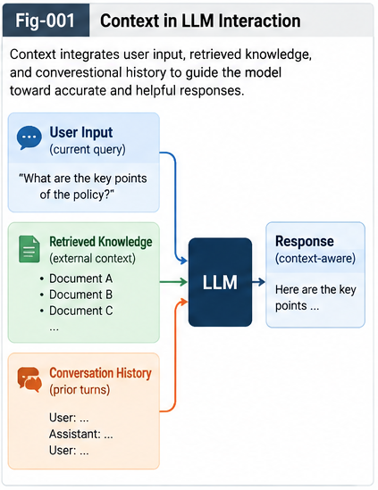

# Metric-Differential-Tree UTN and Context-Bound Token Intelligence

## MDT-UTN-CBT

**Context is primary. Naming is secondary.**

This repository develops an algorithmic framework for turning structural context into reusable identity, explicit context-bound encoding, and addressable intelligence.

The central path is:

```text
Context
   ↓
GenericContainerStarmap
   ↓
Metric Similarity / Distance
   ↓
Metric-Differential Tree
   ↓
Universal Typing & Naming
   ↓
Context-Bound Token
   ↓
token@context
   ↓
Search · LLM · Cache · Delta Intelligence · Brain Units
````

The core proposition is simple:

> **Fold context into structural identity; expose structural identity as reusable token-level intelligence.**

---

# 1. Why This Repository?

Many intelligent systems repeatedly face the same hidden problem:

> What does this object mean **here**?

A token such as:

```text
open
```

may refer to:

```text
open a file
open a network socket
open a database transaction
open a repository
open a UI window
```

The lexical token alone does not preserve the structural context required to distinguish these meanings.

A conventional system often reconstructs this context repeatedly through:

```text
prompt interpretation
semantic inference
search
retrieval
reasoning
tool selection
runtime observation
```

This repository asks a different question:

> **Can context itself become an explicit structural identity that can be localized, typed, named, encoded, searched, cached, reused, and evolved?**

Our answer is:

```text
Yes —
through MDT-UTN and Context-Bound Token Intelligence.
```

---

# 2. The Central Thesis

Universal Typing and Naming should not begin with names.

It should begin with:

```text
Target
   ↓
Context
   ↓
Structural Representation
   ↓
Metric Localization
   ↓
Structural Type
   ↓
Name
```

Therefore:

> **UTN is not fundamentally a naming problem.**

It is:

> **a context-preserving structural localization, folding, and controlled naming problem over a Metric-Differential Tree.**

This reverses the conventional naming relationship.

Instead of:

```text
Object
   ↓
Name
   ↓
Meaning
```

we propose:

```text
Object
   ↓
Structural Context
   ↓
Metric Position
   ↓
Structural Neighborhood
   ↓
Differential Boundary
   ↓
Type
   ↓
Name
```

---



---


# 3. Context Is Primary

A name is a symbolic interface.

The underlying evidence is context.

The structural hierarchy is therefore:

```text
Structural Identity
        ↓
Universal Type ID
        ↓
Canonical Name
        ↓
Local Aliases
```

This distinction is important because:

```text
Rename
≠
Identity Change
```

and:

```text
Same Name
≠
Same Structural Identity
```

Universal intelligence does not require every system to use the same lexical name.

It requires:

> **Universal Structural Addressability.**

---

# 4. GenericContainerStarmap

A target context can be represented as a structured feature container:

```text
GenericContainerStarmap
```

Conceptually:

```text
Context {
    Domain
    Space
    Time
    Role
    State
    Behavior
    Dependencies
    CallingGraph Position
    Policy
    History
    ...
}
```

Different applications may preserve different dimensions.

The important requirement is that the context becomes structurally comparable.

---

# 5. Metric Similarity and Distance

Once contexts are represented structurally, they can be compared.

Conceptually:

```text
Context A
   ↕
Metric Similarity / Distance
   ↕
Context B
```

This creates the basis for:

```text
localization
clustering
difference detection
candidate typing
parent formation
leftover separation
```

Metric similarity does not itself prove that two objects should share a type.

It generates a structural candidate.

That candidate must still be validated.

---

# 6. Metric-Differential Tree

The Metric-Differential Tree — MDT — organizes structurally related contexts into progressively differentiated neighborhoods.

Conceptually:

```text
                    Root
                     │
             ┌───────┴───────┐
             │               │
         Region A         Region B
             │
        ┌────┴────┐
        │         │
      Type A1   Type A2
        │
    ┌───┴───┐
    │       │
 Leaf 1   Leaf 2
```

The MDT converts a potentially global UTN problem into a local structural decision.

Instead of asking:

> Which type among everything does this target belong to?

the system asks:

> What is the target's local metric neighborhood, and what structural decision is required here?

---

# 7. Per-Node UTN Intelligence

The direct leaf neighborhood becomes the primary UTN decision region.

Each relevant MDT node can support:

```text
Metric Evidence
+
Positive Merge Evidence
+
Counter-Evidence
+
Historical Cases
+
Policy
+
LLM Assistance
+
Unit-Test / QA Evidence
+
Human Review
```

This creates:

> **Per-Node UTN Intelligence**

The canonical local process is:

```text
Preserve Context
      ↓
Metric Localization
      ↓
Candidate Formation
      ↓
Positive Evidence Search
      ↓
Counter-Evidence Search
      ↓
Leftover Separation
      ↓
Policy Evaluation
      ↓
Type Decision
      ↓
Naming
      ↓
Validation
      ↓
Commit
      ↓
Learn
```

---

# 8. Leaf Immutability Principle

Leaves are structural individuals.

A leaf should preserve:

```text
original context
original name
source
version
provenance
evidence
```

The default rule is:

> **Fold upward; do not erase downward.**

Typing creates shared structure above individuals.

It should not destroy the evidence from which that structure was formed.

---

# 9. Typing First, Naming Second

MDT-UTN separates two operations that are often incorrectly combined.

## Universal Typing

Ask:

> Can these structural individuals legitimately share a parent type?

Inputs may include:

```text
metric similarity
context compatibility
positive evidence
counter-evidence
policy
historical merge cases
unit tests
human knowledge
```

Output:

```text
shared type
existing parent
new parent
split
leftover
defer
```

## Universal Naming

Only after a type has been structurally justified do we ask:

> What should this type be called?

Naming may use:

```text
existing terminology
repository vocabulary
domain vocabulary
aliases
LLM suggestions
historical naming
human policy
```

Therefore:

> **UTN is Typing-first, Naming-second.**

---

# 10. Two-Way Structural Search

Similarity is evidence for a possible merge.

It is not sufficient evidence for a valid merge.

MDT-UTN therefore requires Two-Way Search:

```text
Candidate Merge
      │
      ├── Search FOR the merge
      │
      └── Search AGAINST the merge
```

The second direction searches for:

```text
counter-examples
incompatible state
different behavior
policy conflicts
version conflicts
semantic conflicts
structural exceptions
```

Only after both directions are considered should a structural type be committed.

---

# 11. Explicit Leftover

Not every target should be merged.

A valid structural outcome is:

```text
LEFTOVER
```

This may represent:

```text
insufficient evidence
novel structure
high noise
policy uncertainty
conflicting context
temporary isolation
```

Therefore:

> **Leftover is not failure.**

It is an explicit representation of unresolved structure.

A leftover today may become a valid structural branch tomorrow.

---

# 12. Evolutionary UTN

UTN should not be treated as a one-time global classification operation.

It is evolutionary.

```text
New Context
     ↓
Localize
     ↓
Compare
     ↓
Type / Leftover
     ↓
Validate
     ↓
Structural Delta
     ↓
MDT Growth
```

The resulting UTN tree becomes a historical record of structural evolution.

---

# 13. Composable UTN

A universal tree should not require every raw individual to be globally reprocessed.

Instead:

```text
Local UTN
    ↓
Subsystem UTN
    ↓
Repository UTN
    ↓
Organization UTN
    ↓
Domain UTN
    ↓
Evolving Universal UTN
```

The governing principle is:

> **Fold locally, merge folded structures globally, and unfold only where ambiguity requires deeper inspection.**

This turns universality into an emergent result of composable local structural decisions.

---

# 14. Tree Merge

Two mature MDT-UTN trees already contain folded structural intelligence.

Tree merge should therefore begin from their folded structure rather than flattening them back into raw leaves.

```text
Tree A
   \
    → Structural Alignment
    → Candidate Branch Matching
    → Selective Unfolding
    → Per-Node UTN
    → Merged Tree
   /
Tree B
```

Only ambiguous regions need deeper inspection.

This is:

> **Hierarchical MDT Merge**

or:

> **Folded UTN Merge**

---

# 15. Evolutionary Identity

Structural identity should remain stable even when:

```text
names change
aliases change
parents evolve
local trees merge
policies improve
versions advance
```

A useful identity stack is:

```text
Structural Identity
        ↓
Stable UTN Type ID
        ↓
Canonical Name
        ↓
Local Aliases
```

A human-readable name is therefore not the deepest identity layer.

---

# 16. From UTN to Context-Bound Tokens

Once MDT-UTN produces an explicit structural identity, that identity can be exposed to existing token-based systems.

We call this representation:

> **Context-Bound Token — CBT**

Canonical notation:

```text
token@context
```

Examples:

```text
open@FileIO

open@NetworkSocket

commit@GitRepository

commit@DatabaseTransaction

node@CallingGraph

rollback@DatabaseTransaction
```

CBT makes previously implicit structural context explicit.

---

# 17. CBT Is Not LLM-Specific

Context-Bound Tokens are not defined as an LLM-only mechanism.

They can serve as structural units for:

```text
Search
Indexing
Query Routing
Cache
LLM Input
RAG
Agents
Delta Intelligence
Brain-Unit Dispatch
CallingGraph Intelligence
```

The larger idea is:

> **Structural intelligence can be introduced as an encoding increment rather than a complete algorithmic replacement.**

---

# 18. Dual-Track Encoding

CBT should normally augment the raw token rather than replace it.

Example:

```text
open
open@FileIO
```

The raw token provides:

```text
compatibility
broad recall
baseline semantics
```

The Context-Bound Token provides:

```text
structural precision
localization
routing evidence
```

Thus:

```text
Raw Token
   +
Context-Bound Token
   ↓
Dual-Track Structural Encoding
```

---

# 19. Structural Encoding Ladder

CBT can evolve incrementally.

```text
token
```

then:

```text
token@Domain
```

then:

```text
token@Space
```

or:

```text
token@Time
```

then combinations such as:

```text
token@Domain@Space
```

and eventually:

```text
token@UTN-Type
```

or:

```text
token@CCC-Type
```

This creates a low-intrusion path from ordinary token systems toward structural encoding.

---

# 20. Domain · Space · Time

The first canonical context subspaces are:

```text
Domain
Space
Time
```

They answer:

```text
Domain
→ What structural world are we in?

Space
→ Where are we inside that world?

Time
→ Which state or version of that world applies?
```

Example:

```text
rollback@DatabaseTransaction
rollback@TransactionManager
rollback@Version42
```

Together they form a compact structural coordinate system.

---

# 21. Rich Context, Sparse Encoding

The full Context Starmap may contain many dimensions.

That does not mean all dimensions should be injected.

The preferred principle is:

> **Preserve context richly; project context selectively.**

Therefore:

```text
Rich Context Storage
        ↓
Metric / Context Policy
        ↓
Sparse Structural Projection
        ↓
CBT
```

This avoids premature information loss while controlling runtime cost.

---

# 22. Baseline-Preserved Context Injection

Explicit structural context must remain experimentally controllable.

Therefore MDT-UTN-CBT introduces:

> **Baseline-Preserved Context Injection — BPCI**

The rule is:

> **Every context-enhanced input should preserve a mechanically recoverable context-free baseline.**

Example:

```text
Baseline:
rollback transaction
```

Enhanced:

```text
rollback
rollback@DatabaseTransaction
transaction
```

Removing the CBT augmentation returns the original baseline.

---

# 23. Every Context Injection Carries Its Own Control Group

Let:

```text
S0 = Baseline Input
```

and:

```text
S1 = Context-Enhanced Input
```

with:

```text
S1 = S0 + C
```

where:

```text
C = explicit structural context augmentation
```

Then:

```text
Remove(C, S1) = S0
```

This gives every enhanced inference a natural paired control.

---

# 24. Context Gain

The effect of explicit context can therefore be measured.

Conceptually:

```text
Context Gain
=
Performance(Context-Enhanced Input)
-
Performance(Baseline Input)
```

The actual performance measure is task-specific.

It may include:

```text
answer accuracy
localization accuracy
search precision / recall
ranking score
verifier score
CallingGraph consistency
cache correctness
routing quality
latency
tool-call reduction
```

No access to hidden model logits is required.

---

# 25. Context Is Evidence, Not Command

Explicit context should influence inference.

It should not dictate it unconditionally.

Conceptually:

```text
Final Decision
=
Baseline Evidence
+
Policy-Controlled Context Evidence
```

Context confidence, counter-evidence, validation, and policy determine how strongly explicit context should affect the result.

Wrong explicit context can be worse than no explicit context.

Therefore ambiguity and backoff must remain first-class states.

---

# 26. Context Density

Even correct context can be over-injected.

Define conceptually:

```text
Context Injection Density
=
Injected Context-Bound Units
/
Relevant Baseline Units
```

The central question becomes:

> How much explicit structural context is enough?

Possible regimes:

```text
CID-0
No explicit context

CID-L
Sparse context

CID-M
Selective context

CID-H
Dense context
```

The expected engineering objective is not maximum density.

It is:

> **Minimum Sufficient Context Density.**

---

# 27. Start Sparse

A useful runtime strategy is:

```text
Baseline
   ↓
Sparse Context
   ↓
Sufficient?
   ├── Yes → Stop
   └── No
        ↓
     Add Context
        ↓
     Revalidate
```

This is:

> **Progressive Context Injection**

It mirrors selective structural unfolding.

---

# 28. Context Density as Fold / Unfold

A compact CBT is a folded representation of richer context.

Example:

```text
rollback@DatabaseTransaction
```

may summarize:

```text
Domain
Space
Time
State
Policy
History
```

When ambiguity remains:

```text
Folded Context
      ↓
Unfold More Context
      ↓
Validate
      ↓
Refold Successful Policy
```

Thus context density becomes another Fold/Unfold mechanism.

---

# 29. Context as an Address

The next step is more important than prompt augmentation.

Once context has a stable structural identity, it can become an address.

The core proposition is:

> **Context is not merely additional information for a query; it is an address for computation, caching, intelligence reuse, and structural growth.**

The address path is:

```text
Raw Object / Query
       ↓
Context Starmap
       ↓
MDT Localization
       ↓
UTN Structural Identity
       ↓
Context Address
```

---

# 30. One Address, Multiple Intelligence Planes

A Context Address can be reused across:

```text
Search Plane
Cache Plane
CCC / Experience Plane
Delta Intelligence Plane
Brain-Unit Dispatch Plane
LLM / Reasoning Plane
```

This creates a common structural namespace across previously separate subsystems.

---

# 31. Structural Search

Traditional search often begins from flat lexical terms.

Context-addressed search can use:

```text
Exact Context
      ↓
Parent Context
      ↓
Sibling Context
      ↓
Broader Structural Region
      ↓
Raw Token Fallback
```

For example:

```text
rollback@DatabaseTransaction
        ↓
rollback@Transaction
        ↓
rollback@Database
        ↓
rollback
```

This is hierarchical structural search.

---

# 32. Context-Addressed Cache

Traditional cache:

```text
Query
   ↓
Result
```

Context cache:

```text
Query@Context
      ↓
Result
```

Structural Intelligence Cache:

```text
UTN / CCC Type
      ↓
Query Pattern
      ↓
Validated Result
      ↓
Evidence
      ↓
Structural Delta
      ↓
Policy
```

This is no longer merely cache reuse.

It approaches:

> **Folded Structural Memory.**

---

# 33. Computational Folding

An expensive LLM or search result should not necessarily be preserved only as:

```text
Query
→
Answer
```

Instead it can be folded as:

```text
Context Type
+
Query Pattern
+
Validated Result
+
Evidence
+
Confidence
+
Structural Delta
+
Policy
```

This transforms repeated computation into reusable structural experience.

We call this:

> **Computational Folding**

---

# 34. Cache Levels

A useful progression is:

```text
L0 — Raw Cache

Query
→ Result
```

```text
L1 — Context Cache

Query@Context
→ Result
```

```text
L2 — Structural Intelligence Cache

UTN / CCC Type
→ Query Pattern
→ Validated Result
→ Delta
→ Evidence
→ Policy
```

L2 is better understood as structural memory than as a conventional cache.

---

# 35. Context-Localized Delta Intelligence

A validated action can be archived under the structural context in which it succeeded or failed.

```text
Context Address
      ↓
Task
      ↓
Action
      ↓
Structural Delta
      ↓
Validation
```

Successful cases become reusable positive Delta Intelligence.

Failed cases become reusable negative Delta Intelligence.

---

# 36. TACG-SDIG Integration

Historical context-localized cases can form:

```text
Task
→ Action
→ Structural Delta
→ Validation
```

experience.

Future MDT-UTN decisions can search these historical cases as additional evidence.

Thus:

```text
MDT-UTN
+
TACG-SDIG
```

creates a path from structural localization to accumulated decision intelligence.

---

# 37. Brain-Unit Dispatch

Context identity can also become a routing address.

The progression is:

```text
UTN Type
   ↓
CCC Identity
   ↓
Brain-Unit Address
```

Conceptually:

```text
UTN:
What is this structurally?

CCC:
What known structural experience does it belong to?

Brain Unit:
Who should think about it?

Unfolding:
What should happen next?
```

---

# 38. Structural Intelligence Dispatch Node

An MDT node can eventually hold:

```text
UTN Type
Canonical Name
Aliases
Metric Policy
CCC Reference
Query Cache
Positive Cases
Negative Cases
Counter-Evidence
Delta Intelligence
Brain Unit
Dispatch Policy
Confidence
Leftover Policy
Version
Provenance
```

This turns the MDT node into a:

> **Structural Intelligence Dispatch Node**

---

# 39. Context-Addressed Intelligence Runtime

The broader runtime can be represented as:

```text
User / API
    ↓
Context Encoder
    ↓
GenericContainerStarmap
    ↓
MDT Localization
    ↓
UTN Structural Identity
    ↓
Context Address
    │
    ├── Search
    ├── Cache
    ├── Delta Intelligence
    ├── CCC
    └── Brain Unit
           ↓
       LLM / Specialist
           ↓
        Action
           ↓
       Validation
           ↓
    Structural Delta
           ↓
          Fold
           ↓
      MDT / UTN Growth
```

This forms a closed intelligence-growth loop.

---

# 40. LLM as Expensive Fallback

As structural memory grows, every request does not necessarily need full LLM reasoning.

A possible runtime strategy is:

```text
Phase 1
Structural Localization and Reuse

Cache
Delta Intelligence
CCC
Brain Unit
```

then:

```text
Phase 2
Expensive Search / LLM Reasoning
only when necessary
```

This is a natural Two-Phase architecture.

The degree of computational reduction is an engineering hypothesis to be measured, not assumed.

---

# 41. Unknown and Ambiguous Context

MDT-UTN-CBT must preserve:

```text
UNKNOWN
AMBIGUOUS
TOP-K
LEFTOVER
```

states.

If context cannot be validated, the system should not force a structural address.

Possible actions include:

```text
use baseline
broaden search
preserve Top-K contexts
request more evidence
invoke LLM
invoke human review
create leftover
```

Uncertainty is structural information.

---

# 42. Context Confidence

Context may come from:

```text
User
API / Upper Layer
MDT-UTN
CCC
Historical Cases
LLM Inference
```

Different sources have different confidence.

A useful principle is:

> **Provided context normally outranks inferred context, while inferred context remains available as counter-evidence.**

Strong disagreement should trigger structural validation rather than silent override.

---

# 43. Top-Down and Bottom-Up Context

Two complementary mechanisms exist.

## Top-Down

```text
User / API
    ↓
Explicit Context
    ↓
token@context
```

## Bottom-Up

```text
Raw Input
    ↓
LLM / Structural Estimator
    ↓
Top-K Context Candidates
    ↓
MDT Localization
```

Together:

```text
Top-Down Context Injection
+
Bottom-Up Context Estimation
```

provide a more robust localization process.

---

# 44. Structural Prompt Engineering

CBT also provides a path from verbose prompt engineering toward structural prompt encoding.

Instead of repeatedly writing:

```text
In the context of database transaction rollback...
```

a system may expose:

```text
rollback@DatabaseTransaction
```

The goal is not to replace natural language.

It is to provide a compact explicit structural anchor alongside it.

---

# 45. Context Search Reduction

Explicit context can potentially reduce the number of candidate interpretations that must be explored.

Conceptually:

```text
Context Search Reduction Ratio
=
Candidate Contexts Before Localization
/
Candidate Contexts After Localization
```

This can be measured for:

```text
LLM reasoning
search
query routing
tool selection
Brain-Unit dispatch
```

The intended effect is:

> **Reduce unnecessary work without reducing necessary doubt.**

---

# 46. Validation Framework

v1.0.0 deliberately focuses on algorithmic validation methodology rather than a full executable runtime.

The validation package asks three successive questions.

```text
VALIDATION-001
Baseline-Preserved Context Injection
        ↓
Does explicit context help?
```

```text
VALIDATION-002
Domain-Space-Time Context Matrix
        ↓
Which context helps?
```

```text
VALIDATION-003
Context Density Policy Protocol
        ↓
How much context should be injected?
```

Together:

```text
Whether?
   ↓
Which?
   ↓
How Much?
```

---

# 47. VALIDATION-001 — Baseline-Preserved Context Injection

The first validation establishes a recoverable control group.

Compare:

```text
Baseline
```

against:

```text
Baseline + Explicit Structural Context
```

Measure:

```text
Context Gain
Cost
Stability
Validation
Counter-Evidence Recovery
```

This determines whether explicit context provides measurable benefit.

---

# 48. VALIDATION-002 — Domain-Space-Time Matrix

The second validation factorizes context into:

```text
Domain
Space
Time
```

and tests all eight primary combinations:

| ID |  D |  S |  T |
| -- | -: | -: | -: |
| A0 |  0 |  0 |  0 |
| A1 |  1 |  0 |  0 |
| A2 |  0 |  1 |  0 |
| A3 |  0 |  0 |  1 |
| A4 |  1 |  1 |  0 |
| A5 |  1 |  0 |  1 |
| A6 |  0 |  1 |  1 |
| A7 |  1 |  1 |  1 |

The goal is to identify:

> **Minimum Sufficient Context**

rather than blindly maximizing context dimensions.

---

# 49. VALIDATION-003 — Context Density Policy

The third validation sweeps context density.

```text
No Context
   ↓
Sparse
   ↓
Selective
   ↓
Dense
   ↓
Stress Test
```

It measures:

```text
Context Gain
Marginal Density Gain
Token Cost
Latency
Stability
Wrong-Context Recovery
```

The target is:

> **Minimum Sufficient Density**

not maximum injection.

---

# 50. Context Policy

The three validations can eventually produce a reusable policy:

```text
ContextPolicy
{
    whenToInject
    whichContext
    howDeep
    howDense
    whereToPlace
    whenToBackoff
}
```

This moves context handling from informal prompt craftsmanship toward measurable structural policy.

---

# 51. Core Algorithmic Invariants

The repository proposes the following invariants.

### 1. Context Is Primary

Names are interfaces over structural identity.

### 2. Typing Precedes Naming

A valid structural type should exist before a preferred lexical label is required.

### 3. Leaves Preserve Evidence

Structural folding should not erase individual context and provenance.

### 4. Similarity Creates Candidates, Not Truth

Metric closeness alone does not authorize a merge.

### 5. Counter-Evidence Is Mandatory

Search both for and against structural unification.

### 6. Leftover Is Explicit

Unknown and exceptional structures must remain representable.

### 7. UTN Is Evolutionary

Structural identity grows with new evidence.

### 8. Universality Is Composable

Global identity should emerge through local structural integration.

### 9. CBT Augments the Baseline

Structural encoding should not erase the raw representation.

### 10. Context Influence Is Measurable

Every enhanced input should preserve a recoverable control.

### 11. Context Is Policy-Governed

More context is not automatically better.

### 12. Validated Structural Deltas Become Intelligence

Successful and failed cases should be reusable.

---

# 52. What This Repository Does Not Claim

This repository does **not** claim that:

```text
token@context
```

must be one atomic tokenizer vocabulary token.

Existing tokenizers may split the textual representation.

CBT is first defined as a:

> **token-level lexical-symbolic structural encoding unit**

rather than a tokenizer implementation requirement.

The repository also does not assume access to:

```text
attention matrices
hidden logits
internal model states
```

Validation can use externally measurable task outcomes.

Finally, the repository does not assume:

```text
more context = better result
```

That proposition is explicitly subjected to validation.

---

# 53. v1.0.0 Scope

This release is an:

> **Algorithmic Foundation Release**

Its purpose is to:

```text
define the structural problem
define the algorithmic architecture
define the invariants
define the validation methodology
define the evolutionary direction
```

It deliberately does not bury the core ideas under an early runtime implementation.

No Java runtime is required for v1.0.0.

---

# 54. Core Articles

The repository contains six main articles.

### MDT-UTN-CBT-001

**From Context to Universal Typing and Naming**

Introduces Context-first UTN, GenericContainerStarmap, metric localization, structural identity, Typing-first Naming-second, and evolutionary UTN.

### MDT-UTN-CBT-002

**Metric-Differential Tree and Per-Node UTN Intelligence**

Defines MDT localization, local candidate formation, Two-Way search, leftover handling, Per-Node Intelligence, QA, and the canonical local UTN algorithm.

### MDT-UTN-CBT-003

**Composable UTN Tree Merge and Evolutionary Identity**

Develops local-first UTN, folded tree merge, selective unfolding, universal structural identity, aliases, provenance, and versioned tree evolution.

### MDT-UTN-CBT-004

**Context-Bound Tokens for Structural Encoding**

Defines CBT and `token@context`, dual-track encoding, Domain/Space/Time, Search, LLM, Cache, Delta, and Brain-Unit applications.

### MDT-UTN-CBT-005

**Baseline-Preserved Context Injection**

Defines paired-control structural injection, Context Gain, negative delta learning, counterfactual comparison, density control, and policy-governed context influence.

### MDT-UTN-CBT-006

**Context as an Address for Search, Cache, Delta, and Brain Units**

Extends context from evidence into a shared structural address for computation, memory, routing, reuse, and intelligence growth.

---

# 55. Validation Documents

```text
validation/
├── VALIDATION-001-Baseline-Preserved-Context-Injection.md
├── VALIDATION-002-Domain-Space-Time-Context-Matrix.md
└── VALIDATION-003-Context-Density-Policy-Protocol.md
```

These documents provide an implementation-independent experimental methodology for the first release.

---

# 56. Recommended Reading Paths

## Track A — MDT-UTN

```text
001
 ↓
002
 ↓
003
```

Question:

> **Where does explicit structural context identity come from?**

## Track B — CBT Intelligence

```text
004
 ↓
005
 ↓
006
```

Question:

> **What can an intelligent system do once context identity becomes explicit?**

## Track C — Validation

```text
VALIDATION-001
       ↓
VALIDATION-002
       ↓
VALIDATION-003
```

Question:

> **Does context help, which context helps, and how much should be used?**

---

# 57. Repository Structure

```text
Metric-Differential-Tree-UTN-and-Context-Bound-Token-Intelligence/
│
├── README.md
├── START-HERE.md
├── CONTENTS.md
├── GLOSSARY.md
├── FIGURE-INDEX.md
├── FUTURE-DIRECTIONS.md
│
├── MDT-UTN-CBT-001-From-Context-to-Universal-Typing-and-Naming.md
├── MDT-UTN-CBT-002-Metric-Differential-Tree-and-Per-Node-UTN-Intelligence.md
├── MDT-UTN-CBT-003-Composable-UTN-Tree-Merge-and-Evolutionary-Identity.md
├── MDT-UTN-CBT-004-Context-Bound-Tokens-for-Structural-Encoding.md
├── MDT-UTN-CBT-005-Baseline-Preserved-Context-Injection.md
├── MDT-UTN-CBT-006-Context-as-an-Address-for-Search-Cache-Delta-and-Brain-Units.md
│
├── validation/
│   ├── VALIDATION-001-Baseline-Preserved-Context-Injection.md
│   ├── VALIDATION-002-Domain-Space-Time-Context-Matrix.md
│   └── VALIDATION-003-Context-Density-Policy-Protocol.md
│
├── figures/
│   ├── Fig-001-MDT-UTN-CBT-Grand-Map.png
│   ├── Fig-002-Context-to-MDT-to-UTN.png
│   ├── Fig-003-Per-Node-UTN-Intelligence.png
│   ├── Fig-004-Composable-MDT-UTN-Tree-Merge.png
│   ├── Fig-005-Token-Context-Dual-Track-Encoding.png
│   ├── Fig-006-Baseline-Preserved-Context-Injection.png
│   └── Fig-007-Context-Addressed-Intelligence-Runtime.png
│
├── CITATION.cff
├── .zenodo.json
├── CHANGELOG.md
└── GitHub-Release-Notes-v1.0.0.md
```

---

# 58. Seven Canonical Figures

The visual architecture is organized around seven figures:

```text
Fig-001
MDT-UTN-CBT Grand Map

Fig-002
Context → MDT → UTN

Fig-003
Per-Node UTN Intelligence

Fig-004
Composable MDT-UTN Tree Merge

Fig-005
Token-Context Dual-Track Encoding

Fig-006
Baseline-Preserved Context Injection

Fig-007
Context-Addressed Intelligence Runtime
```

Together they move from:

```text
Context Structure
```

to:

```text
Structural Identity
```

to:

```text
Structural Encoding
```

to:

```text
Reusable Runtime Intelligence
```

---

# 59. Relationship to Structural Folding

MDT-UTN-CBT belongs naturally to the broader Fold/Unfold architecture.

```text
Raw Context
    ↓
Structural Folding
    ↓
MDT / UTN Identity
    ↓
CBT
    ↓
Runtime Localization
    ↓
Search / Cache / Brain Unit / Reasoning
    ↓
Action
    ↓
Validation
    ↓
Structural Delta
    ↓
Refolding
```

Repeated successful computation becomes increasingly addressable structural experience.

---

# 60. Relationship to CCC

UTN identifies:

```text
What is this structurally?
```

CCC can then identify:

```text
What known structural experience
does this belong to?
```

This creates:

```text
Context
   ↓
UTN Type
   ↓
CCC Identity
   ↓
Known Structural Experience
```

CBT provides a compact interface through which this identity can reach existing runtime systems.

---

# 61. Relationship to Brain Units

A mature architecture can continue:

```text
Context
   ↓
MDT
   ↓
UTN
   ↓
CCC
   ↓
Brain Unit
```

Thus structural localization can become computation routing.

Instead of asking one general engine to rediscover the whole problem space, the system can increasingly ask:

> **Which structural specialist already owns this region?**

---

# 62. Relationship to Structural Continual Learning

Every validated:

```text
typing decision
tree merge
context injection
query result
cache reuse
action
structural delta
```

can become future evidence.

Therefore the system can grow through:

```text
Local Experience
      ↓
Validated Delta
      ↓
Folded Structural Memory
      ↓
Policy / MDT / CCC Growth
```

This is a path from repeated computation toward structural continual learning.

---

# 63. Research Direction

The larger research question is:

> **How can evolving structural contexts be progressively typed and named through metric-differential folding while preserving local identity, provenance, counter-evidence, compositional mergeability, and full evolutionary traceability?**

The CBT extension adds a second question:

> **How can those structural identities be exposed to existing token-based systems with minimal algorithmic disruption?**

And Context-as-Address adds a third:

> **Can one structural context identity become a common address for reasoning, search, caching, delta intelligence, and specialized computation?**

---

# 64. Future Experimental Ladder

A natural future validation sequence is:

```text
L0
Raw Token / Prompt

L1
Ordinary Natural-Language Context

L2
Raw Token + CBT

L3
Policy-Controlled CBT Density

L4
MDT-UTN Generated Context

L5
MDT-UTN + CCC

L6
MDT-UTN + CCC + Brain-Unit Dispatch
```

This keeps each architectural increment independently measurable.

---

# 65. Future Runtime Direction

A later runtime may introduce components such as:

```text
ContextBoundToken

GenericContainerStarmap

MetricDifferentialTree

MdtNode

UtnType

UtnMergePolicy

ContextProjectionPolicy

ContextDensityPolicy

BaselineContextEvaluator

StructuralCache

DeltaIntelligenceStore

BrainUnitDispatcher
```

But these implementation choices are intentionally deferred beyond the v1.0.0 algorithmic foundation.

---

# 66. Release Roadmap

## v1.0.0 — Algorithmic Foundation

```text
MDT-UTN
CBT
BPCI
Context-as-Address
Validation Protocols
```

## v1.1.0 — Reference Validation

```text
Synthetic Cases
Canonical A/B Examples
Validation Matrices
Context-Gain Studies
```

## v1.2.0 — API and Runtime Skeleton

```text
Reference Data Structures
Context API
MDT Node API
Policy Interfaces
Cache / Dispatch Interfaces
```

## v2.0.0 — Executable Structural Runtime

Potentially:

```text
Java 8
JUnit4
Canonical Demos
MDT Tree Merge
Context Cache
Delta Intelligence
Brain-Unit Dispatch
```

---

# 67. Six Canonical Claims

This repository can be summarized through six claims.

### Claim 1

> **Context is primary; names are interfaces.**

### Claim 2

> **MDT turns metric context relationships into an evolving structural substrate for UTN.**

### Claim 3

> **UTN is Typing-first, Naming-second, with explicit leftover and counter-evidence.**

### Claim 4

> **Context-Bound Tokens expose structural identity while preserving compatibility with token-based systems.**

### Claim 5

> **Context injection should preserve a recoverable baseline so its intelligence gain can be measured and controlled.**

### Claim 6

> **Context can become a common structural address for reasoning, search, caching, delta intelligence, and Brain-Unit dispatch.**

---

# 68. One-Line Architecture

```text
Context → Starmap → MDT → UTN → CBT → Structural Address → Reusable Intelligence
```

---

# 69. One-Line UTN Principle

> **Context first. Type second. Name third.**

---

# 70. One-Line CBT Principle

> **Keep the token; bind the context.**

---

# 71. One-Line Validation Principle

> **Every context-enhanced inference should carry its own recoverable control group.**

---

# 72. One-Line Density Principle

> **Use the minimum structural context that produces maximum validated utility.**

---

# 73. One-Line Runtime Principle

> **Localize first; reuse what is known; reason expensively only where necessary.**

---

# 74. One-Line Evolution Principle

> **Every validated structural delta is a candidate for future intelligence.**

---

# 75. Grand Summary

```text
                         CONTEXT
                            │
                            ▼
                GenericContainerStarmap
                            │
                            ▼
                Metric Similarity / Distance
                            │
                            ▼
              METRIC-DIFFERENTIAL TREE
                            │
                            ▼
                PER-NODE UTN INTELLIGENCE
                            │
              ┌─────────────┼─────────────┐
              ▼             ▼             ▼
           TYPE         LEFTOVER        ALIAS
              │
              ▼
        STRUCTURAL IDENTITY
              │
              ▼
       CONTEXT-BOUND TOKEN
          token@context
              │
      ┌───────┼────────┬──────────┬───────────┐
      ▼       ▼        ▼          ▼           ▼
    SEARCH   LLM     CACHE       DELTA      BRAIN UNIT
      │       │        │          │           │
      └───────┴────────┴──────────┴───────────┘
                       │
                       ▼
                 ACTION / RESULT
                       │
                       ▼
                    VALIDATE
                       │
              ┌────────┴────────┐
              ▼                 ▼
        POSITIVE DELTA     NEGATIVE DELTA
              │                 │
              └────────┬────────┘
                       ▼
                 STRUCTURAL FOLD
                       │
                       ▼
              MDT / UTN / POLICY GROWTH
                       │
                       └───────────────→ CONTEXT
```

---

# 76. Final Perspective

The purpose of MDT-UTN-CBT is not merely to invent a better naming convention.

It is to connect several problems that are usually treated separately:

```text
typing
naming
context
encoding
search
cache
reasoning
routing
continual learning
```

through one structural principle:

> **Context can be folded into identity.**

Once that identity exists:

```text
it can be named,
it can be encoded,
it can be searched,
it can be cached,
it can address historical intelligence,
it can dispatch specialized computation,
and it can evolve.
```

This produces the full progression:

```text
Context
   ↓
Structural Identity
   ↓
Structural Address
   ↓
Reusable Intelligence
   ↓
Validated Structural Delta
   ↓
Structural Growth
```

The resulting objective is not merely better context handling.

It is:

> **an evolving structural intelligence system in which context becomes a first-class address for computation, memory, and learning.**

---

## Canonical Statement

> **Context is primary. Naming is secondary.
> Structural identity is the bridge.
> Context-Bound Tokens expose that identity.
> Validation controls its influence.
> Context addressing turns it into reusable intelligence.**


---

## Author

Sizhe Tan\
Independent Researcher

GPT-Obot\
AI Research Assistant

2026

DOI: TBD
    
---

## 📚 DBM-SI Series Navigation

See:\
[./docs/DBM-SI-Series-of-gitHub-Repositories/DBM-SI-Series-of-gitHub-Repositories.md](./docs/DBM-SI-Series-of-gitHub-Repositories/DBM-SI-Series-of-gitHub-Repositories.md)

[./docs/DBM-SI-Series-of-gitHub-Repositories/DBM-SI-Structural-Intelligence-Dictionary-(v2).md](./docs/DBM-SI-Series-of-gitHub-Repositories/DBM-SI-Structural-Intelligence-Dictionary-(v2).md)


