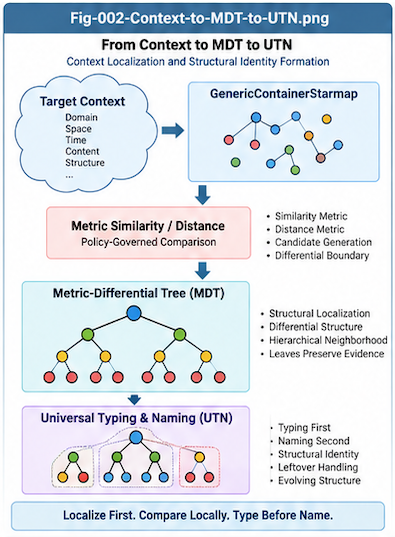

# MDT-UTN-CBT-001 — From Context to Universal Typing and Naming

## Context Is Primary; Naming Is Secondary

**Repository:** Metric-Differential-Tree UTN and Context-Bound Token Intelligence (MDT-UTN-CBT)  
**Document:** MDT-UTN-CBT-001  
**Status:** Algorithmic Foundation  
**Version:** v1.0.0

---

## Abstract

Universal Typing and Naming (UTN) is often approached as if the primary problem were to assign names to objects, functions, concepts, or structures.

This repository starts from the opposite direction.

The primary object is not the name.

The primary object is the **context of the target structure**.

A name is only a symbolic interface used by humans, programs, repositories, APIs, or intelligent systems to reference a structure that already exists in some context.

This distinction becomes especially important for AI coding, CallingGraph intelligence, distributed repositories, evolving software systems, heterogeneous knowledge spaces, and long-lived structural memory.

If structural contexts can be represented by a common carrier such as `GenericContainerStarmap`, then their similarities and differences can be measured.

Once metric similarity exists, contextual structures can be localized, compared, clustered, separated, folded, and progressively organized into a **Metric-Differential Tree (MDT)**.

Within such a tree, Universal Typing and Naming becomes a localized structural intelligence problem:

- leaves preserve original contextual individuals;
- near-leaf and parent nodes represent candidate structural commonality;
- Per-Node Intelligence decides whether contexts should remain separate, share a type, form a parent structure, retain leftover identities, or receive canonical names;
- names become stable interfaces over evolving structural identities rather than substitutes for those identities.

The central thesis of this document is:

> **Context is primary. Structural identity is derived from context. Typing organizes structural identity. Naming exposes structural identity through symbolic interfaces.**

This provides a foundation for an evolutionary, composable, auditable, and context-preserving UTN system.

---

# 1. The Naming Problem Is Usually Misframed

A conventional naming process is often imagined as:

```text
Object
  ↓
Class
  ↓
Name
````

or even more simply:

```text
Object
  ↓
Name
```

This is convenient, but structurally incomplete.

The object being named already exists within a context before a name is assigned.

A software function has:

* callers;
* callees;
* parameters;
* return types;
* exceptions;
* data dependencies;
* repository location;
* task context;
* runtime behavior;
* historical changes;
* tests;
* policies;
* surrounding software structure.

A concept in another domain similarly exists inside a network of properties, relationships, histories, roles, constraints, and interactions.

Therefore, a more faithful ordering is:

```text
Target Structure
      ↓
Context
      ↓
Structural Representation
      ↓
Structural Identity
      ↓
Type
      ↓
Name
```

The name is not the origin of identity.

The name is an interface to identity.

---

# 2. Context Before Name

Consider two software elements that are both called:

```text
open
```

One may mean:

```text
open a file
```

while another may mean:

```text
open a network socket
```

A lexical name alone does not preserve enough information.

The contexts do:

```text
open@FileIO
open@NetworkSocket
```

The distinction is not created by the added label.

The distinction already existed in the target structures.

The label merely exposes it.

This motivates the first principle of MDT-UTN:

> **The structural context of a target exists prior to its symbolic name.**

This principle is not limited to software.

It applies broadly wherever one structure must be typed, localized, compared, or named relative to others.

---



---

# 3. Structural Identity Is Not the Same as Name

A Universal Typing and Naming system should distinguish at least four layers:

```text
Structural Identity
        ↓
Universal Type
        ↓
Canonical Name
        ↓
Local Alias
```

These layers serve different purposes.

## 3.1 Structural Identity

Structural identity is grounded in the target's represented context and structural relationships.

It should remain meaningful even when names change.

For example:

```text
Customer
Client
AccountHolder
```

may be three lexical names used by different systems.

They may remain valid local names while sharing some higher structural identity.

Therefore:

> **Same structural identity does not require the same lexical name.**

Likewise:

```text
Node
```

can refer to radically different structures in different systems.

Therefore:

> **Same lexical name does not imply the same structural identity.**

---

## 3.2 Universal Type

A Universal Type represents validated structural commonality among one or more contextual structures.

It should be formed through structural evidence rather than lexical convenience.

A type may initially exist without a polished human-readable name.

For example:

```text
UTN-TYPE-8F32A
```

may be structurally valid before it is later given a canonical name such as:

```text
RetryableTransactionalAction
```

This leads to an important rule:

> **Typing does not need to wait for naming.**

---

## 3.3 Canonical Name

A canonical name is a preferred symbolic interface for a validated type.

It may be chosen using:

* historical names;
* repository vocabulary;
* domain terminology;
* LLM suggestions;
* human judgment;
* organizational policies;
* compatibility requirements;
* prior successful naming cases.

The name is important.

But it remains secondary to structural evidence.

---

## 3.4 Local Alias

Different systems may preserve different names:

```text
Customer
Client
AccountHolder
```

while mapping them to the same or related structural type.

Therefore, UTN should not become a global forced-renaming mechanism.

Its goal is better described as:

> **Universal structural addressability rather than universal lexical uniformity.**

---

# 4. GenericContainerStarmap as a Context Carrier

A universal UTN framework requires a sufficiently general way to represent heterogeneous contextual structures.

In this research line, `GenericContainerStarmap` serves as such a carrier.

A target context may contain:

```text
Named scalar values
Named string values
Named numeric sequences
Named string sequences
Relationships
Roles
Behavioral traces
Task context
Action context
Spatial context
Temporal context
Version context
Domain context
```

For a software function, a conceptual representation might include:

```text
FunctionContext
├── package
├── class
├── method-name
├── parameter-types
├── return-type
├── callers
├── callees
├── exceptions
├── data-dependencies
├── task-context
├── runtime-trace
├── repository
├── version
└── tests
```

The key requirement is not that every target use the same fields.

The key requirement is that heterogeneous contexts can be translated into a common metric-compatible structural carrier.

This gives:

```text
Target
   ↓
Context
   ↓
GenericContainerStarmap
```

---

# 5. Why Metric Similarity Exists

Typing is meaningful only because contextual structures exhibit similarities and differences.

If two target structures had no comparable dimensions, no structural typing relationship could be established.

But in practice, contexts frequently share comparable features.

For example:

```text
Function A
├── accepts transaction
├── retries on timeout
├── invokes database
└── returns status

Function B
├── accepts transaction
├── retries on deadlock
├── invokes database
└── returns status
```

These structures may have meaningful similarity across:

```text
behavior
calling context
data context
task role
exception structure
runtime outcome
```

Once the context is represented, similarity can be modeled through a metric or composite metric:

```text
Context A
    ↕
Metric Similarity / Distance
    ↕
Context B
```

This does not imply that one universal distance formula must exist.

Different UTN decisions may use different metric policies.

---

# 6. Rich Context, Policy-Governed Metrics

A structural context should generally preserve more information than any single decision requires.

This leads to the principle:

> **Preserve rich context; govern effective dimensions by metric policy.**

For example, a stored function context may contain:

```text
signature
callers
callees
runtime traces
task role
repository
version
tests
exceptions
data dependencies
```

while one UTN operation may use:

```text
Signature Similarity       0.20
Calling Context            0.30
Behavior                   0.35
Task Context               0.15
```

Another operation may use a completely different policy.

Therefore:

```text
Stored Context
      ≠
Effective Metric View
```

Instead:

```text
Stored Context
      ↓
Metric Policy
      ↓
Effective Structural Perspective
```

This preserves future flexibility.

It also supports:

* coarse typing;
* fine typing;
* domain-specific typing;
* temporal typing;
* repository-specific typing;
* perspective-dependent structural localization.

---

# 7. From Metric Contexts to the Metric-Differential Tree

Once contextual structures can be represented and compared, they no longer need to remain a flat collection.

They can be progressively organized according to structural similarity and difference.

This produces a:

> **Metric-Differential Tree (MDT)**

Conceptually:

```text
                         Root
                          │
               ┌──────────┴──────────┐
               │                     │
          Structural A          Structural B
           /       \              /       \
         A1         A2          B1         B2
        /  \       /  \
      L1   L2    L3   L4
```

The tree does not merely represent taxonomy.

It represents accumulated structural distinctions.

Each branching decision records some form of difference.

Each parent represents some form of commonality.

Each leaf preserves a structural individual or unresolved residual case.

This gives UTN a geometry.

---

# 8. Why MDT Changes the UTN Problem

Without structural localization, UTN can appear to require a global intelligence capable of comparing everything against everything.

That scales poorly in both computation and reasoning.

MDT changes the problem.

Instead of asking:

> What is the universal name for this new object?

the system can ask:

> Where does this context localize within the existing metric structure?

Then:

```text
New Context
    ↓
Metric Localization
    ↓
Candidate MDT Region
    ↓
Candidate Parent / Siblings
    ↓
Per-Node UTN Decision
```

The global problem becomes a local problem.

This is one of the most important structural advantages of MDT-UTN.

> **Global universality can emerge from composable local structural decisions.**

---

# 9. Leaves Are Structural Individuals

Leaves should not be treated as disposable raw data.

A leaf is a preserved structural individual.

It may contain:

```text
Leaf
├── original context
├── original name
├── source
├── provenance
├── version
├── evidence
└── local metadata
```

This motivates the:

## Leaf Immutability Principle

> **The original contextual identity and original name of a leaf should remain unchanged by default.**

A higher-level UTN operation may create:

```text
Parent Type
```

above multiple leaves.

But the leaves themselves should remain available for:

* explanation;
* rollback;
* version comparison;
* future reclassification;
* counter-evidence;
* historical reconstruction;
* alternative metric policies.

This is especially important for evolutionary UTN.

---

# 10. Parent Nodes Represent Structural Commonality

A parent node should not be understood simply as:

> a shared name assigned to several children.

Instead, it should represent:

> **validated structural commonality among descendant contexts.**

For example:

```text
                RetryableTransactionalAction
                     /              \
                    /                \
         retryOnTimeout        retryOnDeadlock
```

The parent exists because some common structure has been justified.

The parent name is merely the symbolic expression of that type.

This leads naturally to:

```text
Children
   ↓
Structural Commonality
   ↓
Parent Type
   ↓
Canonical Name
```

not:

```text
Children
   ↓
Convenient Shared Name
```

---

# 11. Typing First, Naming Second

The separation of typing from naming is essential.

Typing asks:

> Do these contextual structures justify a common structural parent?

Naming asks:

> What symbolic interface should represent that validated parent?

Therefore, the UTN runtime should conceptually contain two stages.

## Stage A — Universal Typing

Inputs may include:

```text
Metric similarity
Structural context
Counter-evidence
Historical cases
Policy
Validation
```

Output:

```text
Validated Structural Type
```

## Stage B — Universal Naming

Inputs may include:

```text
Validated type
Existing terminology
Repository vocabulary
Domain vocabulary
Historical names
LLM suggestion
Human preference
Naming policy
```

Output:

```text
Canonical Name
Local Aliases
```

This separation avoids forcing semantic naming decisions too early.

---

# 12. Similarity Creates Candidates, Not Truth

Metric similarity is necessary.

But it is not sufficient.

Two structures may appear highly similar while still containing one decisive difference.

Therefore:

```text
Similarity
    ↓
Candidate Merge
```

must not automatically become:

```text
Similarity
    ↓
Final Merge
```

Instead:

```text
Similarity
    ↓
Candidate
    ↓
Positive Evidence
    ↓
Counter-Evidence
    ↓
Leftover Separation
    ↓
Validated Type
```

This is especially important in coding systems, where a small behavioral difference may carry major semantic significance.

---

# 13. Two-Way Structural Search

A robust UTN system should perform two complementary searches.

## Search A — Evidence For

Ask:

> Why should these structures share a type?

Possible evidence:

```text
similar behavior
similar call structure
similar task role
similar data flow
similar runtime outcome
similar historical evolution
```

## Search B — Evidence Against

Ask:

> Why should these structures not share a type?

Possible evidence:

```text
different safety behavior
different lifecycle
different side effects
different ownership
different temporal assumptions
different policies
different external contracts
```

This creates:

```text
Candidate Group
      │
      ├── Accepted Structural Core
      │
      └── Explicit Leftover
```

The leftover is not failure.

It is preserved structural information.

---

# 14. Explicit Leftover Is Part of UTN

A universal system should not force every object into a currently known type.

It must support:

```text
Known
Ambiguous
Novel
Residual
Conflicting
```

contexts.

Therefore:

```text
New Context
   ↓
MDT Search
   │
   ├── confident match
   │      ↓
   │    typed
   │
   ├── ambiguous
   │      ↓
   │   multi-candidate / deferred
   │
   └── unsupported
          ↓
       leftover
```

This enables the UTN structure to evolve without destroying information.

It also supports later learning.

Today's leftover may become tomorrow's new branch.

---

# 15. UTN Is Evolutionary

A universal naming system cannot reasonably be frozen.

Software evolves.

Domains evolve.

Vocabulary evolves.

Contexts evolve.

Structural relationships evolve.

Therefore UTN must support:

```text
Existing MDT
    +
New Contexts
    +
New Evidence
    +
New Policies
    ↓
Updated MDT
```

The target is not:

```text
One Final Universal Dictionary
```

but:

```text
Evolving Universal Structural Identity
```

This distinction is fundamental.

---

# 16. Local First, Universal Through Composition

A universal UTN structure should not require one centralized all-in-one construction process.

Instead:

```text
Subsystem A
    ↓
MDT-A

Subsystem B
    ↓
MDT-B

Subsystem C
    ↓
MDT-C
```

These structures can later be compared and merged:

```text
MDT-A + MDT-B
      ↓
    MDT-AB
```

then:

```text
MDT-AB + MDT-C
       ↓
     MDT-ABC
```

This leads to:

```text
Local UTN
   ↓
Subsystem UTN
   ↓
Repository UTN
   ↓
Organization UTN
   ↓
Domain UTN
   ↓
Evolving Universal UTN
```

Universality is therefore compositional.

---

# 17. Structural Identity Should Be Auditable

Every important UTN merge should retain enough information to explain itself.

A conceptual record may include:

```text
UTNMergeRecord
├── parent-type
├── child-nodes
├── metric-policy
├── similarity-evidence
├── positive-evidence
├── counter-evidence
├── leftovers
├── naming-evidence
├── LLM-suggestion
├── human-decision
├── QA-result
├── provenance
├── timestamp
└── version
```

This makes it possible to ask:

```text
Why does this type exist?
Why were these leaves merged?
Why was this leaf excluded?
Which metric policy was used?
What evidence supported the merge?
What counter-evidence was rejected?
Who named the parent?
What changed between versions?
```

Therefore MDT-UTN is not merely a naming table.

It can become:

> **an auditable evolutionary structural identity system.**

---

# 18. Human, LLM, Policy, and Historical Intelligence

Per-Node UTN decisions should not depend on one intelligence source.

They may combine:

```text
Metric Structure
Historical Cases
LLM Reasoning
Human Judgment
Policy
Validation
```

Conceptually:

```text
                 Per-Node UTN Intelligence
                           │
          ┌────────────────┼────────────────┐
          ▼                ▼                ▼
      Metric Rules    Historical Cases      LLM
          │                │                │
          └──────────┬─────┴─────┬──────────┘
                     ▼           ▼
                   Policy      Human
                     │           │
                     └─────┬─────┘
                           ▼
                       Validation
                           │
                           ▼
                        Commit
```

The purpose is not to maximize algorithmic complexity.

The purpose is to isolate difficult naming and typing decisions into small, inspectable structural locations.

---

# 19. UTN as Per-Node Intelligence

This leads to one of the central ideas of MDT-UTN.

Universal Typing and Naming does not need to exist as one giant global intelligence.

Instead, MDT localizes the problem.

Each relevant leaf or near-leaf parent can host small-scale Per-Node Intelligence that answers questions such as:

```text
Should these leaves share a parent?
Should one leaf remain leftover?
Does a new structural type need to be created?
Should an existing canonical name be reused?
Should a new alias be added?
Is the evidence sufficient?
Should the decision be deferred?
Should LLM or human review be requested?
```

Therefore:

> **MDT converts a global UTN problem into many local structural decisions.**

This is one of the main algorithmic motivations for the framework.

---

# 20. From UTN to Context-Bound Tokens

Once a structural type becomes explicit, it can be exposed to downstream systems.

For example:

```text
rollback
```

may become:

```text
rollback@DatabaseTransaction
```

or:

```text
commit@GitRepository
commit@DatabaseTransaction
```

This repository calls such a representation a:

> **Context-Bound Token (CBT)**

The significance is that MDT-UTN does not stop at producing internal structural identities.

Those identities can become consumable by existing token-based systems.

This creates the bridge:

```text
Context
   ↓
GenericContainerStarmap
   ↓
Metric-Differential Tree
   ↓
UTN Type / Name
   ↓
token@context
   ↓
Token-Based Intelligence
```

Possible consumers include:

```text
Search
Indexing
Query Systems
Caches
LLMs
RAG
Agents
Delta Intelligence
Brain Units
```

The detailed CBT model is developed in later documents of this repository.

---

# 21. Canonical MDT-UTN Pipeline

The foundational pipeline can now be summarized as:

```text
Real Target Structure
        │
        ▼
     Context
        │
        ▼
GenericContainerStarmap
        │
        ▼
Metric Representation
        │
        ▼
Metric-Differential Tree
        │
        ▼
Structural Localization
        │
        ▼
Per-Node UTN Intelligence
        │
   ┌────┼─────────┬──────────┐
   ▼    ▼         ▼          ▼
 Keep  Merge    Leftover   Escalate
   │    │         │          │
   └────┴────┬────┴──────────┘
             ▼
      Validated Type
             │
             ▼
       Canonical Name
             │
             ▼
         Local Aliases
             │
             ▼
    Version + Provenance
             │
             ▼
      Context-Bound Token
```

This pipeline captures the core transition:

> **From contextual structure to reusable structural identity.**

---

# 22. Core Principles

The first MDT-UTN foundation can be summarized by the following principles.

## Principle 1 — Context Primacy

> A target's structural context exists before its name.

## Principle 2 — Identity/Name Separation

> Structural identity, type, canonical name, and local alias are distinct layers.

## Principle 3 — Metric Representability

> Contexts that require typing and naming should be representable in a metric-compatible structural form.

## Principle 4 — Rich Context Preservation

> Preserve rich context; let policy determine the effective metric dimensions.

## Principle 5 — Leaf Preservation

> Original contextual individuals and their names remain unchanged by default.

## Principle 6 — Typing Before Naming

> Structural commonality should be established before canonical naming.

## Principle 7 — Similarity Is Candidate Evidence

> Metric similarity proposes a merge; it does not prove one.

## Principle 8 — Counter-Evidence Is First-Class

> Every important merge should support explicit search for reasons not to merge.

## Principle 9 — Leftover Is Structural Information

> Unmerged, ambiguous, and novel leaves should remain explicit.

## Principle 10 — Universality Is Compositional

> Local UTN structures can progressively merge into larger UTN structures.

## Principle 11 — Evolution Is Mandatory

> UTN must support structural growth, versioning, reinterpretation, and rollback.

## Principle 12 — Naming Is an Interface

> Universal Typing and Naming should provide universal structural addressability without requiring universal lexical uniformity.

---

# 23. What MDT-UTN Is Not

MDT-UTN should not be confused with:

### A global dictionary

It does not attempt to force all systems to use one vocabulary.

### A flat ontology

It is intended to evolve through metric structural evidence.

### A pure clustering algorithm

Clustering similarity alone is insufficient; counter-evidence, leftovers, policy, provenance, and validation matter.

### A rename engine

Existing names are preserved by default.

### An LLM-only system

LLMs can assist reasoning and naming, but the structural substrate exists independently.

### A one-time taxonomy build

The structure is expected to grow and change.

---

# 24. Research Questions

This framework raises several research questions.

### RQ-1

How should heterogeneous structural contexts be represented while preserving enough information for future typing decisions?

### RQ-2

Which metric families are most useful for different UTN domains?

### RQ-3

How should composite similarity weights be selected and evolved?

### RQ-4

How should Per-Node Intelligence balance positive evidence and counter-evidence?

### RQ-5

When should a candidate remain a leftover instead of being merged?

### RQ-6

How can local MDT structures be efficiently merged without reprocessing every individual leaf?

### RQ-7

How should structural identity persist across repository, organization, domain, and temporal boundaries?

### RQ-8

How should canonical names and aliases evolve without destroying historical identity?

### RQ-9

How can successful UTN decisions become reusable Delta Intelligence?

### RQ-10

How can explicit UTN identities improve token-based systems through Context-Bound Tokens?

---

# 25. Relationship to the Rest of This Repository

This document establishes the conceptual foundation.

The following documents develop the framework further.

```text
MDT-UTN-CBT-001
From Context to Universal Typing and Naming
        │
        ▼
MDT-UTN-CBT-002
Metric-Differential Tree and Per-Node UTN Intelligence
        │
        ▼
MDT-UTN-CBT-003
Composable UTN Tree Merge and Evolutionary Identity
        │
        ▼
MDT-UTN-CBT-004
Context-Bound Tokens for Structural Encoding
        │
        ▼
MDT-UTN-CBT-005
Baseline-Preserved Context Injection
        │
        ▼
MDT-UTN-CBT-006
Context as an Address for Search, Cache,
Delta Intelligence, and Brain Units
```

The first three documents answer:

> **Where does explicit structural context identity come from?**

The final three answer:

> **What can intelligent systems do once that identity becomes explicit?**

---

# 26. Conclusion

Universal Typing and Naming should not begin with names.

It should begin with structures in context.

A target structure first exists.

Its context can then be represented.

Represented contexts can be compared through metric similarity and difference.

Those relationships can be progressively folded into a Metric-Differential Tree.

Within that tree, Universal Typing and Naming becomes a collection of localized, auditable, policy-governed Per-Node Intelligence decisions.

This changes the fundamental sequence from:

```text
Object
  ↓
Name
```

to:

```text
Context
  ↓
Structural Representation
  ↓
Metric Localization
  ↓
Metric-Differential Tree
  ↓
Structural Type
  ↓
Canonical Name
```

The resulting system preserves the distinction between:

```text
identity
type
name
alias
```

and supports:

```text
locality
composition
counter-evidence
leftovers
versioning
provenance
evolution
```

The core conclusion is therefore:

> **Context is primary; naming is secondary.**

And the larger architectural consequence is:

> **Once context becomes an explicit structural identity, that identity can be reused as an address for future intelligence.**

This is the foundation on which MDT-UTN and Context-Bound Token Intelligence are built.

---

## Canonical Summary

```text
Context
  ↓
GenericContainerStarmap
  ↓
Metric Similarity / Distance
  ↓
Metric-Differential Tree
  ↓
Per-Node UTN Intelligence
  ↓
Structural Type
  ↓
Canonical Name / Alias
  ↓
Context-Bound Token
  ↓
Reusable Structural Intelligence
```

> **Fold context into structural identity.
> Expose structural identity through stable symbolic interfaces.
> Preserve the original context so the structure can continue to evolve.**
