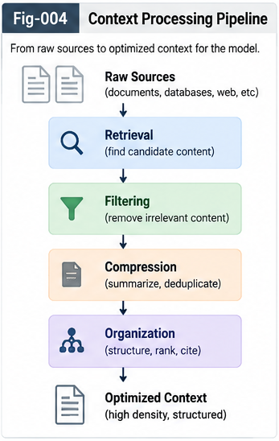

# MDT-UTN-CBT-003 — Composable UTN Tree Merge and Evolutionary Identity

## From Local MDTs to Evolving Universal Structural Identity

**Repository:** Metric-Differential-Tree UTN and Context-Bound Token Intelligence (MDT-UTN-CBT)  
**Document:** MDT-UTN-CBT-003  
**Status:** Algorithmic Foundation  
**Version:** v1.0.0

---

## Abstract

Universal Typing and Naming should not be built as one global all-in-one classification operation.

Real systems evolve locally.

Repositories evolve independently.

Subsystems acquire their own vocabularies, contexts, types, naming conventions, policies, historical decisions, and structural memories.

Therefore, a practical Universal Typing and Naming framework must support the progressive composition of many local structures.

This document introduces **Composable UTN Tree Merge**.

Each subsystem first constructs its own Metric-Differential Tree (MDT), preserving local contexts, names, aliases, policies, provenance, leftovers, and Per-Node Intelligence.

These local MDTs can then be compared and merged progressively:

```text
MDT-A + MDT-B
      ↓
    MDT-AB

MDT-AB + MDT-C
       ↓
     MDT-ABC
````

The central principle is:

> **Fold locally, merge folded structures globally, and unfold only where ambiguity requires deeper inspection.**

This provides a path from:

```text
Local UTN
   ↓
Subsystem UTN
   ↓
Repository UTN
   ↓
Organization UTN
   ↓
Domain UTN
   ↓
Evolving Universal UTN
```

without requiring every individual context to be globally reprocessed from scratch.

The resulting UTN is not a frozen universal dictionary.

It is an **evolutionary structural identity system** that supports:

* local autonomy;
* compositional growth;
* hierarchical merge;
* provenance;
* alias preservation;
* conflict handling;
* explicit leftovers;
* rollback;
* version history;
* metric-policy evolution;
* complete structural explanation.

The central thesis is:

> **Universality should emerge from composable structural identity, not from forced global lexical uniformity.**

---

# 1. Why Universal UTN Cannot Be All-in-One

A naive model of Universal Typing and Naming might assume:

```text
All Contexts
     ↓
One Global Typing Engine
     ↓
One Universal Tree
     ↓
One Universal Naming System
```

This is unrealistic for large evolving systems.

In practice:

* different repositories evolve at different times;
* different teams use different names;
* different domains use different structural dimensions;
* different systems apply different metric policies;
* some branches mature while others remain sparse;
* historical naming decisions cannot simply be erased;
* local identities may remain valid even after larger structural unification.

Therefore a realistic UTN architecture must preserve local structure while supporting higher-level composition.

---

# 2. Local Structure Is the Natural Starting Point

Every subsystem already contains context.

For example:

```text
Subsystem A
├── Functions
├── CallingGraphs
├── Tasks
├── Runtime traces
├── Names
├── Versions
└── Local policies
```

That subsystem can independently construct:

```text
Context
   ↓
GenericContainerStarmap
   ↓
Metric Relationships
   ↓
Local MDT
   ↓
Local UTN
```

Likewise:

```text
Subsystem B
   ↓
MDT-B
```

and:

```text
Subsystem C
   ↓
MDT-C
```

This local-first construction has several advantages:

```text
Lower search cost
Local policy compatibility
Better provenance
Incremental growth
Reduced coordination requirements
Better explainability
```

The system does not need to wait for global consensus before learning locally.

---

# 3. Universality Through Composition

The key architectural shift is:

> **Universal UTN is composed, not centrally declared.**

Conceptually:

```text
MDT-A
   \
    \
     → MDT-AB
    /
MDT-B
```

then:

```text
MDT-AB
    \
     \
      → MDT-ABC
     /
MDT-C
```

and progressively:

```text
Local MDTs
    ↓
Merged Repository MDTs
    ↓
Organization MDTs
    ↓
Domain MDTs
    ↓
Cross-Domain Structural Identity
```

This creates an evolutionary path toward larger structural universality.

---

# 4. Tree Merge Is Not Leaf Reprocessing



The most important efficiency idea is that two mature MDTs should not normally be merged by flattening all leaves and starting again.

A naive merge might do:

```text
MDT-A
  ↓
Flatten all leaves

MDT-B
  ↓
Flatten all leaves

All leaves
  ↓
Global pairwise search
  ↓
Rebuild tree
```

This destroys much of the value already accumulated inside the two trees.

A compositional merge should instead preserve folded structure.

---

# 5. Folded Structures Contain Computation

Suppose MDT-A contains:

```text
100,000 leaves
       ↓
5,000 local types
       ↓
600 higher types
       ↓
80 structural families
```

and MDT-B contains:

```text
80,000 leaves
      ↓
4,000 local types
      ↓
500 higher types
      ↓
70 structural families
```

The higher levels already represent substantial completed computation.

They summarize:

```text
similarity
difference
merge decisions
leftovers
naming history
validation
policy
```

Therefore a merge should first compare:

```text
80 structural families
        ↕
70 structural families
```

rather than immediately comparing:

```text
100,000 individual leaves
          ↕
80,000 individual leaves
```

This leads to the principle:

> **Reuse folded structure before reopening individual evidence.**

---

# 6. Fold First, Merge Second, Unfold When Needed

The canonical compositional strategy is:

```text
Fold locally
      ↓
Merge folded structures
      ↓
Identify ambiguous overlap
      ↓
Unfold only those regions
      ↓
Resolve local conflicts
      ↓
Refold merged result
```

This can be summarized as:

> **Fold locally; merge globally; unfold selectively.**

The merge process therefore becomes a Fold/Unfold operation.

---

# 7. Hierarchical Tree-Merge Search

A conceptual tree-merge algorithm may proceed from coarse to fine.

```text
STEP 1
Compare tree roots / high-level families

STEP 2
Identify candidate overlapping branches

STEP 3
Compare candidate parent nodes

STEP 4
Descend only where similarity is meaningful

STEP 5
Unfold ambiguous or conflicting regions

STEP 6
Run Per-Node UTN Intelligence

STEP 7
Create merged parent structures

STEP 8
Preserve unmatched branches as explicit local structures

STEP 9
Validate

STEP 10
Commit merged version
```

This is structurally analogous to hierarchical search.

---

# 8. Tree Merge Requires Metric Compatibility

Two MDTs may not use exactly the same metric policy.

For example:

```text
MDT-A
Metric emphasis:
Behavior = high
CallingGraph = medium
Version = low
```

while:

```text
MDT-B
Metric emphasis:
Behavior = medium
CallingGraph = high
Version = high
```

Therefore tree merge must explicitly represent metric-policy differences.

Possible outcomes include:

```text
Shared Metric View
Translated Metric View
Perspective-Specific Merge
Deferred Merge
```

The merge should never silently pretend that different metric geometries are identical.

---

# 9. Metric Translation Layer

A useful conceptual layer is:

```text
MDT-A Metric Policy
        ↓
Metric Translation / Alignment
        ↑
MDT-B Metric Policy
```

The purpose is to determine whether two structural regions are comparable.

A merged tree may preserve:

```text
Original local metric
+
Merged metric
+
Policy provenance
```

rather than overwriting local geometry.

---

# 10. Local Identity Must Survive Global Merge

One of the strongest principles of compositional UTN is:

> **Global merging should not destroy valid local identity.**

For example:

```text
System A:
Customer

System B:
Client

System C:
AccountHolder
```

A higher merged structure may establish:

```text
UTN-Type-X
```

with a canonical structural interpretation.

But the local names should remain:

```text
Customer
Client
AccountHolder
```

as aliases or local interfaces.

Therefore:

```text
Global Structural Identity
         │
   ┌─────┼─────┐
   ▼     ▼     ▼
Customer Client AccountHolder
```

This allows interoperability without forced renaming.

---

# 11. Universal Does Not Mean One Name

Universal Typing and Naming should not be misunderstood as:

```text
One type
   ↓
One mandatory global name
```

A better model is:

```text
Structural Identity
        ↓
Universal Type ID
        ↓
Canonical Name
        ↓
Local Aliases
```

For example:

```text
UTN-ID:
utn://structural/type/8F32A

Canonical Type:
TransactionalParticipant

Canonical Name:
TransactionActor

Aliases:
Customer
Client
AccountHolder
```

The universal component is the structural identity.

The lexical interfaces may remain plural.

---

# 12. Evolutionary Identity

A structural identity should remain traceable through time.

Consider:

```text
Type-v1
   ↓
Type-v2
   ↓
Type-v3
```

The system should know:

```text
What changed?
Why did it change?
Which children moved?
Which aliases changed?
Which metric policy changed?
Which evidence caused the change?
Which version introduced the change?
```

Therefore identity evolution should be explicit.

---

# 13. Versioned Structural Identity

A useful conceptual model is:

```text
UTN Structural Identity
        │
        ├── Version 1
        ├── Version 2
        ├── Version 3
        └── ...
```

Each version preserves:

```text
Parent relationships
Child relationships
Aliases
Metric policy
Evidence
Counter-evidence
Leftovers
Validation
Provenance
```

This supports both current use and historical reconstruction.

---

# 14. Merge Records as First-Class Objects

Every significant tree merge should produce an explicit record.

A conceptual structure may be:

```text
UTNTreeMergeRecord
{
    sourceTreeA
    sourceTreeB

    sourceVersionA
    sourceVersionB

    candidateRegions
    metricAlignment

    acceptedMappings
    rejectedMappings
    ambiguousMappings

    createdParents
    reusedParents

    leftoverBranches
    aliasMappings

    evidenceFor
    counterEvidence

    llmSuggestions
    humanDecisions

    qaResults

    outputTree
    outputVersion

    provenance
    timestamp
}
```

This record provides the audit trail for the merge.

---

# 15. Full Structural Traceability

A mature system should support questions such as:

```text
Where did this type originate?

Which local trees contributed to it?

Which original leaves belong to it?

Which leaves were excluded?

Which aliases were preserved?

Which merge policy was used?

Which evidence supported the merge?

What counter-evidence was found?

Did a human override occur?

What changed between versions?

Can the previous structure be reconstructed?
```

This is what makes the system an evolutionary identity system rather than a static taxonomy.

---

# 16. Merge Is Not Always Symmetric

Two trees may have different maturity levels.

For example:

```text
MDT-A
Mature, dense, validated
```

and:

```text
MDT-B
Sparse, experimental, low confidence
```

The merge policy may therefore treat them differently.

Possible strategies include:

```text
Peer Merge
Dominant-Reference Merge
Candidate Attachment
Shadow Merge
Experimental Overlay
```

This should be explicit in policy.

---

# 17. Local Autonomy and Global Alignment

Composable UTN should allow local systems to continue evolving.

A global merged tree should not require every local subsystem to immediately adopt every global change.

Instead:

```text
Local MDT
   ↕
Alignment Layer
   ↕
Merged UTN
```

This enables:

```text
local experimentation
local naming
domain-specific policy
incremental synchronization
controlled adoption
```

The universal structure becomes an alignment framework, not a central coercive authority.

---

# 18. Conflict Is Expected

Tree merging will inevitably encounter conflicts.

Examples include:

```text
Same name, different structure

Different names, same structure

Same leaves, different parent grouping

Different metric policies

Different temporal versions

Different safety policies

Different domain interpretations
```

These should not be hidden.

They should become explicit merge states.

---

# 19. Canonical Conflict States

A tree merge can classify relationships such as:

```text
MATCH
PARTIAL_MATCH
ALIAS_MATCH
PARENT_CONFLICT
POLICY_CONFLICT
TEMPORAL_CONFLICT
SEMANTIC_CONFLICT
INSUFFICIENT_EVIDENCE
LEFTOVER
```

This gives the merge runtime an explicit vocabulary.

---

# 20. Counter-Evidence During Tree Merge

Two branches may appear similar at a high level.

Before merging, the runtime should search downward for structural disagreement.

For example:

```text
High-Level Similarity
       ↓
Candidate Branch Merge
       ↓
Counter-Evidence Search
       ↓
Critical Child Difference?
```

If yes:

```text
Do not force merge
```

Instead:

```text
Preserve separate branch
OR
Create partial common parent
OR
Create perspective-specific structure
```

This preserves structural fidelity.

---

# 21. Explicit Leftover Branches

Tree merging should preserve unmatched structure.

For example:

```text
MDT-A
├── A1
├── A2
└── A3

MDT-B
├── B1
└── B2
```

Suppose:

```text
A1 ↔ B1
A2 ↔ B2
A3 ↔ no match
```

The merged tree should not discard A3.

Instead:

```text
Merged Parent
├── Shared-A1-B1
├── Shared-A2-B2
└── Leftover-A3
```

The leftover may later attract:

```text
future leaves
future branches
future domain mappings
```

This enables structural growth.

---

# 22. Tree Merge and Novel Structure Discovery

A leftover branch may become the seed of a new higher-level type.

For example:

```text
Version 1:
Leftover A3
```

Later:

```text
Version 2:
A3 + C7 + D4
       ↓
New Structural Parent
```

Thus:

> **Leftover today may become structure tomorrow.**

This is central to evolutionary UTN.

---

# 23. Local-to-Global Growth Ladder

A practical deployment path can follow:

```text
Level 0
Individual Contexts

Level 1
Local MDT

Level 2
Subsystem MDT

Level 3
Repository MDT

Level 4
Organization MDT

Level 5
Domain MDT

Level 6
Cross-Domain UTN

Level 7
Evolving Universal Structural Identity
```

Each level reuses the folded structure below it.

---

# 24. Repository-Level UTN

A repository-level MDT may unify:

```text
functions
classes
modules
CallingGraphs
tasks
actions
runtime traces
versions
```

It becomes a structural identity layer for one codebase.

This is already useful without any global system.

---

# 25. Cross-Repository UTN

Two repositories can then compare:

```text
Repository-A MDT
        ↕
Repository-B MDT
```

This enables:

```text
cross-repository type reuse
alias mapping
duplicate structural discovery
shared CallingGraph roles
migration support
common Brain-Unit dispatch
```

This is one of the natural applications for AI coding.

---

# 26. Organization-Level UTN

Within an organization, multiple repositories can contribute to:

```text
Organization MDT
```

This may capture:

```text
shared service types
common architectural roles
domain terminology
internal APIs
repeated task-action patterns
standard runtime behaviors
```

Local repositories still preserve their own names and histories.

---

# 27. Domain-Level UTN

Across organizations or systems, a domain-level structure may emerge.

For example:

```text
Database Domain
Security Domain
CallingGraph Domain
Financial Domain
Medical Domain
```

Each domain may develop:

```text
shared structural types
shared aliases
shared metric policies
shared validation rules
shared Delta Intelligence
```

This creates a stronger basis for collective learning.

---

# 28. Evolving Universal UTN

A universal UTN should be understood as:

```text
A network of progressively aligned structural identities
```

rather than:

```text
A final centralized vocabulary
```

Its universality comes from:

```text
addressability
comparability
traceability
mergeability
alias mapping
structural explanation
```

not from lexical uniformity.

---

# 29. Structural Identity as a Stable Address

A mature UTN type can receive a stable structural address.

Conceptually:

```text
UTN-ID:
utn://coding/callinggraph/type/8F32A
```

The address persists even if:

```text
canonical name changes
aliases change
parent changes
metric policy evolves
new children are added
```

This provides a stable identity layer above mutable lexical names.

---

# 30. Context-Bound Tokens Benefit from Stable Identity

Context-Bound Tokens can reference these stable structural identities.

For example:

```text
rollback@DatabaseTransaction
```

is a human-readable form.

Internally, it could correspond to:

```text
rollback@UTN-8F32A
```

This means the lexical context label may evolve while the structural identity remains stable.

Therefore MDT-UTN provides a durable substrate for CBT.

---

# 31. Tree Merge as Intelligence Reuse

The most important computational gain is not merely fewer comparisons.

It is reuse of previous intelligence.

A mature MDT contains:

```text
past comparisons
past merge decisions
past counter-evidence
past QA
past human review
past naming decisions
past structural deltas
```

Tree merge reuses these results.

Therefore:

> **A folded tree is not only compressed data; it is compressed prior intelligence.**

This is a stronger interpretation of structural folding.

---

# 32. Selective Unfolding

When two high-level branches appear compatible, the system need not immediately inspect every descendant.

Only ambiguous regions need deeper unfolding.

Conceptually:

```text
High-Level Match
      ↓
Confidence High?
   ┌──┴──┐
   │     │
  Yes    No
   │     │
Reuse    ↓
      Unfold Children
           ↓
      Local Resolution
```

This is one of the main efficiency mechanisms of compositional tree merge.

---

# 33. Merge Confidence

Tree merge should maintain confidence or evidence strength.

Possible states include:

```text
Validated
Strong
Moderate
Weak
Ambiguous
Rejected
```

A high-confidence branch may remain folded.

A low-confidence branch may trigger:

```text
deeper metric search
LLM review
historical case search
human review
```

This creates an adaptive merge runtime.

---

# 34. Policy-Governed Merge Depth

Policy can decide how far to unfold.

For example:

```text
Policy A:
High-speed approximate merge

Policy B:
Repository release validation

Policy C:
Safety-critical merge

Policy D:
Research-grade full audit
```

Each policy may use different:

```text
depth
metric thresholds
counter-evidence requirements
QA requirements
human-review thresholds
```

Thus one structural framework can support multiple operational regimes.

---

# 35. Merge and Time

Time is a particularly important context dimension.

A structure may be:

```text
Type@Version1
Type@Version2
Type@Version3
```

Two branches that appear conflicting may actually represent:

```text
the same evolving structure at different times
```

Therefore tree merge should consider temporal context before declaring structural inconsistency.

---

# 36. Temporal Identity

A possible representation is:

```text
Structural Identity
        │
   ┌────┼────┐
   ▼    ▼    ▼
  t1   t2   t3
```

This supports:

```text
historical reconstruction
version-aware search
time-specific aliases
cache invalidation
Delta Intelligence
```

Temporal context becomes part of identity management.

---

# 37. Rollback and Reinterpretation

Because all important merge records are preserved, the system should support rollback.

For example:

```text
Version 12
   ↓
New evidence reveals merge error
   ↓
Rollback / Split
   ↓
Version 13
```

The system should not erase Version 12.

Instead:

```text
Version 12
Historical state

Version 13
Corrected state
```

This enables full evolutionary explanation.

---

# 38. Structural Reinterpretation

A previous merge may have been valid under one metric policy but not under another.

For example:

```text
Policy A:
Behavior-dominant
```

produces one tree.

Later:

```text
Policy B:
Security-dominant
```

may split some nodes.

This does not necessarily mean the earlier tree was wrong.

It may mean:

```text
different structural perspective
```

Therefore UTN should support policy-aware reinterpretation.

---

# 39. Perspective-Preserving UTN

In some cases, multiple valid parent structures may coexist.

For example:

```text
Same Leaf
  │
  ├── Functional Type
  ├── Security Type
  └── Runtime Type
```

A future MDT-UTN implementation may therefore support:

```text
multiple metric views
multiple structural perspectives
```

rather than forcing one single hierarchy.

The v1.0.0 framework leaves this possibility open.

---

# 40. Tree Merge and Delta Intelligence

Every successful tree merge is itself a structural delta.

It contains:

```text
Before
  ↓
Merge Decision
  ↓
After
```

This can be represented as:

```text
Task
  ↓
Action
  ↓
Structural Delta
```

Therefore merge history can feed future Delta Intelligence.

A future merge may ask:

```text
Have similar trees been merged before?
```

and reuse:

```text
historical successful merge patterns
```

This connects MDT-UTN naturally to structural continual learning.

---

# 41. Merge Experience as a Reusable Asset

Historical merge cases can be indexed by context.

For example:

```text
Context:
Cross-Repository CallingGraph Merge

Task:
Align equivalent function-role types

Action:
Merge two parent branches

Delta:
Create shared UTN type

Validation:
Passed
```

This case can later assist another repository pair.

Thus:

> **Tree merge history becomes collective structural experience.**

---

# 42. Canonical Composable Tree-Merge Algorithm

A high-level algorithm can be stated as follows:

```text
INPUT:
    MDT-A
    MDT-B
    Merge Policy P
    Historical Merge Cases H

STEP 1 — Preserve Source Trees
    Preserve identities
    Preserve names
    Preserve aliases
    Preserve provenance
    Preserve versions

STEP 2 — Metric Policy Alignment
    Determine compatible dimensions
    Determine translation / perspective rules

STEP 3 — High-Level Structural Search
    Compare roots and major branches

STEP 4 — Candidate Branch Matching
    Identify likely overlaps

STEP 5 — Selective Unfolding
    Descend only into ambiguous or relevant regions

STEP 6 — Per-Node UTN Analysis
    Search positive evidence
    Search counter-evidence
    identify leftovers

STEP 7 — Identity Mapping
    Reuse compatible types
    create new shared types
    preserve local identities

STEP 8 — Alias Mapping
    Preserve local names
    assign canonical names where appropriate

STEP 9 — Conflict Handling
    represent ambiguity
    represent policy conflicts
    represent leftovers

STEP 10 — QA
    validate merged structure

STEP 11 — Commit New Version
    create output MDT
    write merge records

STEP 12 — Learn
    archive merge delta
    make successful cases reusable
```

---

# 43. Merge Outcomes

A compositional merge should support multiple outcomes.

```text
OUTCOME A
Exact Structural Match

OUTCOME B
Alias Mapping

OUTCOME C
Shared Parent Creation

OUTCOME D
Partial Merge

OUTCOME E
Perspective-Specific Merge

OUTCOME F
Keep Branches Separate

OUTCOME G
Explicit Leftover

OUTCOME H
Conflict Record

OUTCOME I
Deferred Merge

OUTCOME J
Human / LLM Escalation
```

This avoids forcing every merge into a binary success/failure model.

---

# 44. Canonical Merge Example

Suppose:

```text
MDT-A
└── TransactionActions
    ├── retryOnTimeout
    └── retryOnDeadlock
```

and:

```text
MDT-B
└── TransactionRecovery
    ├── retryTransaction
    └── retryAfterConflict
```

The merge process may determine:

```text
TransactionActions
       ↕
TransactionRecovery
```

share a higher commonality.

The merged structure may become:

```text
            RetryableTransactionBehavior
                 /                  \
       TransactionActions      TransactionRecovery
          /       \              /          \
 timeoutRetry  deadlockRetry  retryTx   retryConflict
```

The original local parents remain preserved.

The new parent creates a shared structural identity.

---

# 45. Canonical Evolution Example

At time `t1`:

```text
RetryableTransactionBehavior
```

contains four branches.

At time `t2`, new evidence appears:

```text
retryAfterNetworkPartition
```

The system localizes it nearby.

At time `t3`, additional examples reveal:

```text
NetworkRecoveryBehavior
```

should form a separate child parent.

The structure evolves:

```text
RetryableTransactionBehavior
        │
   ┌────┴────┐
   │         │
DB Retry   Network Retry
```

The original context remains available throughout.

This is evolutionary identity.

---

# 46. Compositional Merge and Query Efficiency

Tree merge also improves later query performance.

Once a shared parent exists:

```text
Query@RetryableTransactionBehavior
```

can access knowledge from:

```text
Repository A
Repository B
Repository C
```

through one structural address.

Without merged UTN identity, each repository may require independent search.

Thus tree merge creates future Query and Cache benefits.

---

# 47. Compositional Merge and Brain Units

A shared type can also become a Brain-Unit dispatch address.

For example:

```text
RetryableTransactionBehavior
        ↓
Transaction-Recovery Brain Unit
```

This allows multiple repositories to reuse the same specialized intelligence.

Therefore:

```text
Tree Merge
   ↓
Shared UTN Identity
   ↓
Shared CBT
   ↓
Shared Brain-Unit Dispatch
```

becomes possible.

---

# 48. Compositional Merge and Context-Bound Tokens

A local token may appear as:

```text
retry@TransactionActions
```

in one system and:

```text
retry@TransactionRecovery
```

in another.

After structural alignment, both may map to:

```text
retry@RetryableTransactionBehavior
```

while preserving the local forms.

This creates:

```text
Local CBT
   ↓
Shared Structural CBT
```

and improves interoperability.

---

# 49. Why This Matters for Collective Learning

If every repository learns independently but cannot align its structural identity, knowledge reuse remains limited.

Composable UTN enables:

```text
Local Experience
      ↓
Local MDT
      ↓
Shared Structural Identity
      ↓
Cross-System Reuse
```

Therefore:

> **Collective learning requires not only shared data, but shared structural addressability.**

MDT-UTN provides one possible mechanism for that addressability.

---

# 50. Core Principles

The compositional UTN framework can be summarized by the following principles.

## Principle 1 — Local-First Construction

> Build useful MDT structures locally before attempting global unification.

## Principle 2 — Folded-Structure Reuse

> Preserve and reuse prior structural computation during merge.

## Principle 3 — Selective Unfolding

> Open only ambiguous or conflicting regions.

## Principle 4 — Local Identity Preservation

> Global alignment does not erase valid local identities.

## Principle 5 — Alias Preservation

> Universal identity does not require lexical uniformity.

## Principle 6 — Explicit Metric Alignment

> Different metric policies must be represented rather than silently collapsed.

## Principle 7 — Explicit Conflict

> Structural disagreement should remain visible.

## Principle 8 — Explicit Leftover

> Unmatched branches are retained as future structural evidence.

## Principle 9 — Versioned Evolution

> Every major structural change should be reconstructable.

## Principle 10 — Merge Experience Reuse

> Successful merges should become future Delta Intelligence.

## Principle 11 — Universality by Composition

> Large UTN structures should emerge through repeated local alignment.

## Principle 12 — Structural Identity Above Naming

> Stable structural identity is more fundamental than canonical vocabulary.

---

# 51. Failure Modes

Several failure modes should be avoided.

## Failure Mode A — Flatten-and-Rebuild

Destroying folded structure before every merge.

## Failure Mode B — Forced Global Renaming

Replacing local names merely to create lexical uniformity.

## Failure Mode C — Hidden Metric Translation

Merging trees with incompatible metrics without recording the difference.

## Failure Mode D — No Conflict State

Forcing ambiguous structures into one parent.

## Failure Mode E — No Leftover

Discarding unmatched branches.

## Failure Mode F — No Version History

Losing the explanation of structural evolution.

## Failure Mode G — Over-Unfolding

Expanding every tree region even when high-level structure is already sufficient.

## Failure Mode H — Global All-in-One Reasoning

Invoking expensive intelligence across all leaves for every merge.

## Failure Mode I — Local Identity Destruction

Overwriting valid subsystem identities.

## Failure Mode J — Static Universal Taxonomy

Treating universal identity as final rather than evolutionary.

---

# 52. Relationship to Previous Documents

The first three documents now form one complete MDT-UTN foundation.

```text
MDT-UTN-CBT-001
Context Is Primary
        ↓
MDT-UTN-CBT-002
Local MDT + Per-Node Intelligence
        ↓
MDT-UTN-CBT-003
Composable Tree Merge + Evolutionary Identity
```

Together they answer:

```text
How is context represented?
How is local structural identity formed?
How do local identities grow into larger universal structures?
```

The next three documents move to the second pillar:

```text
Explicit Structural Identity
        ↓
Context-Bound Token
        ↓
Token-Based Intelligence
```

---

# 53. Research Questions

### RQ-1

How should two MDT metric policies be aligned before tree merge?

### RQ-2

What high-level summaries best support efficient candidate branch matching?

### RQ-3

How should merge depth be selected dynamically?

### RQ-4

When should a local parent survive beneath a newly created shared parent?

### RQ-5

How should alias conflicts be represented across repositories?

### RQ-6

How should temporal evolution affect identity matching?

### RQ-7

How can tree merge confidence be estimated?

### RQ-8

How should counter-evidence propagate upward or downward through a tree?

### RQ-9

When should an unmatched branch become a new universal branch rather than remain local?

### RQ-10

How can historical tree merges become reusable structural merge intelligence?

### RQ-11

How should large shared MDTs be partitioned for distributed operation?

### RQ-12

How should CBTs reference stable structural identity across UTN versions?

---

# 54. Conclusion

Universal Typing and Naming should evolve through composition.

A useful UTN system does not require all contexts to be globally processed from the beginning.

Instead:

```text
Local Context
   ↓
Local MDT
   ↓
Local UTN
   ↓
Tree Merge
   ↓
Larger Structural Identity
```

Mature local structures already contain substantial folded intelligence.

Therefore the preferred strategy is:

> **Fold locally.
> Merge folded structures.
> Unfold only ambiguous regions.
> Preserve local identity.
> Record every structural delta.**

This produces a system that can grow from:

```text
Local UTN
```

to:

```text
Repository UTN
```

to:

```text
Domain UTN
```

and eventually toward:

```text
Evolving Universal Structural Identity
```

without requiring universal lexical uniformity.

The central engineering insight is:

> **A folded MDT is not merely compressed structure; it is reusable prior intelligence.**

The central architectural insight is:

> **Universality emerges through composable structural identity.**

And the central evolutionary insight is:

> **A Universal Typing and Naming system should remain capable of explaining how every shared identity was formed, how it changed, and what local structures still exist beneath it.**

---

## Canonical Summary

```text
Local Contexts
     ↓
Local MDTs
     ↓
Folded Structural Identity
     ↓
┌───────────────┐
│  Tree Merge   │
└───────┬───────┘
        ↓
High-Level Candidate Match
        ↓
Selective Unfolding
        ↓
Per-Node UTN Intelligence
        ↓
Shared Type + Local Identity
        ↓
Aliases + Leftovers + Conflicts
        ↓
QA
        ↓
Versioned Merge Commit
        ↓
Delta Intelligence
        ↓
Larger MDT
        ↓
Evolving Universal UTN
```

> **Local structures can remain local.
> Shared structures can become universal.
> The path between them should remain fully traceable.**

