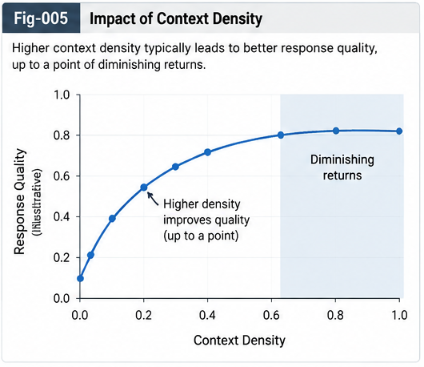

# MDT-UTN-CBT-004 — Context-Bound Tokens for Structural Encoding

## `token@context` as a Low-Intrusion Structural Intelligence Interface

**Repository:** Metric-Differential-Tree UTN and Context-Bound Token Intelligence (MDT-UTN-CBT)  
**Document:** MDT-UTN-CBT-004  
**Status:** Algorithmic Foundation  
**Version:** v1.0.0

---

## Abstract

Most modern information and intelligence systems operate on symbolic units such as:

- words;
- tokens;
- terms;
- identifiers;
- keys;
- query fragments;
- API parameters.

These units are efficient, compatible, and deeply embedded in existing infrastructure.

But a raw token often leaves important structural context implicit.

For example:

```text
open
commit
rollback
node
graph
bank
````

may each represent multiple structurally different meanings.

This document introduces the **Context-Bound Token (CBT)**:

```text
token@context
```

A CBT binds a lexical or symbolic token to an explicit context identity.

Examples include:

```text
open@FileIO
open@NetworkSocket

commit@GitRepository
commit@DatabaseTransaction

node@CallingGraph
node@KnowledgeGraph
```

The context may originate from:

* user or upper-layer specification;
* API metadata;
* Metric-Differential-Tree localization;
* Universal Typing and Naming;
* CCC structural identity;
* LLM-estimated Top-K context;
* domain policy;
* spatial or temporal context.

CBT does not require existing token-based systems to be discarded.

Instead, it provides a **structural encoding increment** that can coexist with raw tokens:

```text
token
+
token@context
```

This dual-track representation preserves the original lexical baseline while exposing additional structural evidence.

The same mechanism can potentially benefit:

* search;
* indexing;
* query routing;
* caches;
* LLM input;
* RAG;
* agents;
* Delta Intelligence;
* Brain-Unit dispatch;
* structural memory.

The central thesis is:

> **Structural intelligence can often be introduced by enriching the unit of representation rather than replacing the surrounding intelligence infrastructure.**

---

# 1. Why Raw Tokens Are Structurally Incomplete

A raw token is often ambiguous.

Consider:

```text
commit
```

Depending on context, it may mean:

```text
commit a Git revision
commit a database transaction
commit a memory write
commit to a decision
```

Likewise:

```text
bank
```

may refer to:

```text
financial institution
river bank
memory bank
banked aircraft turn
```

A raw lexical representation preserves the symbol:

```text
bank
```

but leaves its structural interpretation to later inference.

This is efficient when the context is obvious.

It is less efficient when the receiving system must repeatedly reconstruct the same contextual distinction.

---

# 2. Context Already Exists Before Encoding

The context is not created by the CBT.

It already exists in the situation.

For example:

```text
rollback
```

may occur inside:

```text
DatabaseTransaction
```

or:

```text
Deployment
```

or:

```text
GitRepository
```

The target event therefore already has a structural context.

The CBT simply exposes it:

```text
rollback@DatabaseTransaction
rollback@Deployment
rollback@GitRepository
```

The transformation is:

```text
Implicit Context
      ↓
Explicit Context Identity
      ↓
Context-Bound Token
```

This follows directly from the context-first principle of MDT-UTN.

---

# 3. Definition of Context-Bound Token

A **Context-Bound Token (CBT)** is defined here as:

> **A token-level structural encoding that binds a lexical or symbolic unit to an explicit context identity.**

Canonical notation:

```text
token@context
```

Examples:

```text
open@FileIO
close@NetworkSocket
node@CallingGraph
edge@CallRelation
rollback@DatabaseTransaction
delta@StructuralChange
```

The notation is conceptual.

A concrete implementation may encode the relationship in many forms:

```text
token@context
[token, context]
(token, type-id)
structured JSON
feature vector
special-token pair
metadata channel
```

The important property is not the literal `@` character.

The important property is:

> **explicit binding between token and context identity.**

---



---

# 4. CBT Is Not Merely an LLM Technique

CBT should not be defined by one downstream application.

It is useful anywhere token-like units participate in computation.

Potential consumers include:

```text
Search
Indexing
Query Systems
Caches
LLMs
RAG
Agents
Rule Engines
Delta Intelligence
Brain Units
Structural Memory
```

Therefore:

```text
Context-Bound Token
        ↓
General Structural Encoding Unit
```

is a broader concept than:

```text
Prompt Trick for LLM
```

LLM integration is important.

But it is only one application.

---

# 5. CBT as a Structured Bigram

One useful intuition is to view:

```text
token@context
```

as a kind of structured bigram.

For example:

```text
open@FileIO
```

contains the conjunction:

```text
open
+
FileIO
```

However, CBT differs from a conventional lexical bigram.

A normal bigram usually expresses adjacency:

```text
open file
```

A CBT expresses a structural binding:

```text
open@FileIO
```

The two components do not need to be adjacent in the original natural-language sequence.

Therefore CBT is better understood as:

> **a structural feature conjunction rather than merely an adjacent word pair.**

---

# 6. Why This Matters for Existing Algorithms

Many mature algorithms already know how to operate on token-like features.

Examples include:

```text
term matching
n-gram matching
inverted indexes
ranking
frequency analysis
query expansion
cache lookup
retrieval
token sequence modeling
```

If:

```text
open
```

is already usable by such systems, then:

```text
open@FileIO
```

can often be introduced as an additional structured feature.

This creates a low-intrusion path:

```text
Existing Token System
        +
Context-Bound Tokens
        ↓
Structurally Enriched System
```

without immediately replacing the whole infrastructure.

---

# 7. Dual-Track Representation

CBT should normally augment rather than erase the raw token.

Canonical form:

```text
token
+
token@context
```

For example:

```text
open
open@FileIO
```

The raw token provides:

```text
broad recall
lexical compatibility
baseline behavior
```

The CBT provides:

```text
structural precision
context discrimination
localization
routing hints
```

This dual-track representation is important.

If only:

```text
open@FileIO
```

is preserved, then some broad lexical relationships may be lost.

If only:

```text
open
```

is preserved, contextual ambiguity remains implicit.

Therefore:

> **Raw tokens preserve compatibility; CBTs add structural specificity.**

---

# 8. The Structural Encoding Ladder

A simple encoding ladder may be:

```text
Level 0
token

Level 1
token@Domain

Level 2
token@Space

Level 3
token@Time

Level 4
token@Domain@Space

Level 5
token@Domain@Space@Time

Level 6
token@UTN-Type

Level 7
token@CCC-Type
```

Examples:

```text
commit

commit@Database

commit@TransactionLayer

commit@Version-v3

commit@Database@TransactionLayer

commit@Database@TransactionLayer@Version-v3

commit@UTN-8F32A
```

The degree of contextualization can be controlled by policy.

---

# 9. Domain, Space, and Time as First Context Subspaces

For a first structural encoding framework, three context dimensions are especially useful:

```text
Domain
Space
Time
```

These dimensions are broad, interpretable, and reusable.

---

# 10. Domain Context

Domain answers:

> In what knowledge or functional domain does this token operate?

Examples:

```text
commit@Git
commit@Database

node@CallingGraph
node@NeuralNetwork

model@MachineLearning
model@Finance
```

Domain context reduces broad semantic ambiguity.

---

# 11. Space Context

Space answers:

> Where is this token structurally located?

For software:

```text
method@PaymentService
node@CallingGraph
edge@RepositoryDependencyGraph
```

For a structural system:

```text
delta@LocalMDT
type@RepositoryUTN
```

Space can include:

```text
repository
module
CallingGraph position
tree node
subsystem
runtime layer
organizational scope
```

Space turns context into a localization signal.

---

# 12. Time Context

Time answers:

> Under what temporal state, version, phase, or lifecycle context does this token apply?

Examples:

```text
schema@Version3
cache@CurrentRelease
policy@2026-Q3
function@PreMigration
```

This matters because the same token can refer to different structures at different times.

Time is therefore important for:

```text
version-aware search
cache invalidation
historical reconstruction
Delta Intelligence
policy evolution
```

---

# 13. Domain-Space-Time Composition

These dimensions can be combined.

For example:

```text
rollback@Database@TransactionLayer@Version3
```

or conceptually:

```text
token
   ↓
Domain
   ↓
Space
   ↓
Time
```

The purpose is not to maximize suffix length.

The purpose is to expose only the context that produces useful structural gain.

---

# 14. Context Granularity Must Be Policy-Controlled

A context can be too coarse:

```text
open@IO
```

or more specific:

```text
open@FileIO
```

or extremely specific:

```text
open@FileInputStream@RepositoryA@Version12
```

More context is not automatically better.

Therefore:

> **Context granularity should be governed by policy.**

A possible hierarchy is:

```text
open
  ↓
open@IO
  ↓
open@FileIO
  ↓
open@FileInputStream
```

MDT-UTN can help select the appropriate structural depth.

---

# 15. Rich Context, Sparse Encoding

The underlying context representation may be rich.

For example:

```text
GenericContainerStarmap
├── domain
├── CallingGraph location
├── repository
├── behavior
├── runtime state
├── version
├── task
├── action
└── policy
```

But a CBT does not need to expose every dimension.

Instead:

```text
Rich Structural Context
        ↓
Context Selection Policy
        ↓
Compact CBT
```

This leads to:

> **Store rich context; encode selectively.**

---

# 16. MDT-UTN as a Context Producer

CBT becomes especially powerful when the context is not manually invented but structurally produced.

The pipeline is:

```text
Target Context
      ↓
GenericContainerStarmap
      ↓
Metric-Differential Tree
      ↓
UTN Localization
      ↓
Structural Type Identity
      ↓
Context-Bound Token
```

For example:

```text
rollback
```

is localized to:

```text
UTN-Type:
DatabaseTransactionRollback
```

which can produce:

```text
rollback@DatabaseTransaction
```

or internally:

```text
rollback@UTN-8F32A
```

Thus MDT-UTN acts as the structural identity producer.

CBT acts as the delivery interface.

---

# 17. Human-Readable Context and Structural Context ID

A CBT may use a human-readable context:

```text
rollback@DatabaseTransaction
```

or a stable structural ID:

```text
rollback@UTN-8F32A
```

The two can coexist.

Conceptually:

```text
Human CBT
rollback@DatabaseTransaction

Structural CBT
rollback@UTN-8F32A
```

This provides both readability and identity stability.

---

# 18. Context Can Come From the User

Sometimes the user already knows the context.

For example:

```text
rollback@DatabaseTransaction
```

may be provided directly in a prompt or API request.

This is valuable because the receiving system does not need to guess the domain first.

The upper layer has already supplied relevant information.

Therefore:

> **Provided context can reduce unnecessary inference.**

---

# 19. Context Can Come From an Upper Layer

An API gateway or application layer may already know:

```text
domain
repository
current object
runtime state
user task
version
```

Instead of converting all of this into verbose natural language, it may expose compact structural hints.

For example:

```text
lookup@RepositoryA
```

or:

```text
rollback@DatabaseTransaction
```

This creates a structured interface between application layers and downstream intelligence.

---

# 20. Context Can Be Estimated by an LLM

Not every user will explicitly provide context.

An LLM can estimate likely contexts.

For example:

```text
Input token:
rollback
```

Possible estimated contexts:

```text
DatabaseTransaction   0.55
Deployment            0.25
GitRepository         0.15
Other                 0.05
```

Conceptually:

```text
Raw Token
   ↓
Top-K Context Estimation
   ↓
Candidate CBTs
```

The candidate contexts can then be validated or localized using MDT-UTN.

---

# 21. Top-Down and Bottom-Up Context

This creates two complementary flows.

## Top-Down Context Injection

```text
User / API / Upper Layer
          ↓
Explicit Context
          ↓
token@context
```

## Bottom-Up Context Estimation

```text
Raw Input
   ↓
LLM / Structural Search
   ↓
Top Context Candidates
   ↓
token@context
```

These mechanisms reinforce each other.

---

# 22. Provided Context Should Generally Outrank Inferred Context

If a user explicitly provides:

```text
rollback@DatabaseTransaction
```

the system should not casually replace it with:

```text
rollback@GitRepository
```

because a probabilistic model guessed differently.

A reasonable principle is:

> **Provided context normally outranks inferred context.**

However, inferred context may still serve as counter-evidence.

For example:

```text
Provided:
rollback@DatabaseTransaction

Strong Structural Evidence:
DeploymentRollback
```

The system may trigger:

```text
conflict detection
clarification
multi-context reasoning
leftover handling
```

rather than silently overriding one side.

---

# 23. CBT Can Structure Prompt Engineering

Traditional prompt engineering often expresses context through natural-language instructions:

```text
In the context of database transactions,
interpret rollback as...
```

CBT offers a more compact structural expression:

```text
rollback@DatabaseTransaction
```

This does not eliminate natural-language prompting.

Instead, it creates another channel.

A hybrid prompt can use:

```text
Natural Language
+
Context-Bound Tokens
```

This makes prompt context more explicit and potentially more machine-reusable.

---

# 24. CBT as Structural Prompt Encoding

A structured prompt may include:

```text
task@CodeRepair
repository@PaymentService
function@RetryHandler
rollback@DatabaseTransaction
```

This separates contextual identity from prose.

The receiving model still gets the natural-language request, but also receives explicit structural anchors.

Conceptually:

```text
Prompt
├── Natural Language
└── Structural Context Encoding
```

This may reduce the burden of repeatedly reconstructing context from prose.

---

# 25. CBT and Search

Search systems naturally benefit from context-bound terms.

A raw query:

```text
rollback
```

has broad recall.

A contextual query:

```text
rollback@DatabaseTransaction
```

has greater structural precision.

A hierarchical search can then operate as:

```text
Exact Context Match
      ↓
Parent Context Backoff
      ↓
Sibling Context Search
      ↓
Raw Token Search
```

For example:

```text
rollback@DatabaseTransaction
        ↓
rollback@Transaction
        ↓
rollback@Database
        ↓
rollback
```

This is structurally richer than simple lexical matching.

---

# 26. CBT and Inverted Indexes

An inverted index can potentially store both:

```text
rollback
```

and:

```text
rollback@DatabaseTransaction
```

The raw token supports broad retrieval.

The CBT supports context-localized retrieval.

Conceptually:

```text
Index
├── rollback
├── rollback@DatabaseTransaction
├── rollback@Deployment
└── rollback@GitRepository
```

The index becomes structurally differentiated without abandoning token lookup.

---

# 27. CBT and Query Routing

A query server receiving:

```text
rollback
```

may need to inspect many possible services.

With:

```text
rollback@DatabaseTransaction
```

the routing space can narrow immediately.

Conceptually:

```text
Query
   ↓
Context-Bound Token
   ↓
Structural Localization
   ↓
Candidate Service / Cache / Brain Unit
```

This may reduce unnecessary fan-out.

---

# 28. CBT and Cache Keys

Context also provides a natural cache address.

A raw cache:

```text
rollback → result
```

may be unsafe because multiple meanings collide.

A context-bound cache can distinguish:

```text
rollback@DatabaseTransaction → result A
rollback@Deployment          → result B
rollback@GitRepository       → result C
```

This motivates:

> **Context-addressed caching.**

The detailed runtime implications are developed in MDT-UTN-CBT-006.

---

# 29. CBT and Delta Intelligence

A structural delta should also be archived in context.

Instead of recording only:

```text
rollback → action
```

the system can record:

```text
rollback@DatabaseTransaction
    ↓
validated action
    ↓
structural delta
```

This makes historical intelligence more reusable.

The same lexical operation can have different learned deltas in different contexts.

---

# 30. CBT and Brain-Unit Dispatch

A raw token may not tell the system which specialized intelligence should handle it.

A CBT may.

For example:

```text
rollback@DatabaseTransaction
```

can dispatch toward:

```text
Transaction Brain Unit
```

while:

```text
rollback@Deployment
```

can dispatch toward:

```text
Deployment Brain Unit
```

Thus:

```text
CBT
 ↓
UTN / CCC Identity
 ↓
Brain-Unit Address
```

becomes possible.

---

# 31. CBT and LLM Input

LLMs already process token sequences containing contextual evidence.

CBT can be inserted as additional lexical/structural evidence.

For example:

```text
The service should rollback the transaction.
```

may be augmented as:

```text
The service should rollback rollback@DatabaseTransaction the transaction.
```

or more cleanly:

```text
rollback@DatabaseTransaction
The service should rollback the transaction.
```

The goal is not to assume that the model treats the string as one internal tokenizer token.

A tokenizer may split:

```text
rollback@DatabaseTransaction
```

into multiple subword units.

The important point is:

> **The structural binding is present in the input representation even if the tokenizer internally decomposes it.**

This distinction should remain explicit.

---

# 32. CBT Is a Conceptual Token, Not Necessarily One Vocabulary Token

The notation:

```text
token@context
```

is a logical unit.

It should not be confused with a guarantee that a model tokenizer stores it as one atomic vocabulary item.

There are at least three implementation modes.

## Mode A — Plain Text Encoding

```text
rollback@DatabaseTransaction
```

is inserted as text.

No tokenizer modification is required.

## Mode B — Structured Multi-Token Encoding

The application sends:

```text
rollback
DatabaseTransaction
```

with explicit relationship metadata.

## Mode C — Native Structural Token

A future tokenizer or model may introduce a dedicated context-bound token representation.

The v1.0.0 framework does not require Mode C.

---

# 33. Low-Intrusion Adoption

The first engineering path should be:

```text
Do not modify model internals
Do not replace tokenizer
Do not retrain architecture
```

Instead:

```text
Existing Model / Search System
           +
Frontend Context Encoder
           ↓
token + token@context
```

This allows early A/B validation.

Only if measurable gains justify it should later work consider:

```text
special tokenizer vocabulary
new embedding channels
native context IDs
architectural changes
```

---

# 34. CBT as Attention Evidence Injection

For LLM use, CBT can be interpreted as explicit structural evidence introduced into the input.

Conceptually:

```text
Raw Sentence
     +
Context Evidence
     ↓
Context-Enhanced Sentence
```

The model can attend to both.

The purpose is not to override the base sentence.

The purpose is to alter the available evidence.

This suggests the term:

> **Policy-Controlled Structural Evidence Injection**

CBT is one mechanism for doing this.

---

# 35. Context Should Bias, Not Dictate

Explicit context is powerful.

That also creates risk.

A wrong context may bias reasoning in the wrong direction.

For example:

```text
rollback@GitRepository
```

is harmful if the real operation is:

```text
DatabaseTransaction
```

Therefore CBT should not be treated as infallible truth.

A robust system should preserve:

```text
raw token
context-bound token
context confidence
counter-evidence
```

The policy can decide how strongly the context should influence downstream inference.

---

# 36. Context Confidence

A CBT may carry conceptual confidence:

```text
rollback@DatabaseTransaction [0.95]
```

or:

```text
rollback@DatabaseTransaction [0.55]
```

Confidence may come from:

```text
explicit user declaration
MDT localization
UTN validation
LLM estimation
historical consistency
```

High-confidence contexts can be used more strongly.

Low-confidence contexts may remain candidate evidence.

---

# 37. Multi-Context Representation

Some tokens are genuinely ambiguous.

Instead of forcing one context:

```text
bank@Finance
```

the system may preserve:

```text
bank@Finance
bank@Geography
```

with different confidence.

Conceptually:

```text
Token
  ↓
Top-K Context Candidates
```

This supports ambiguity-preserving structural encoding.

---

# 38. CBT and Explicit Leftover

A token may also fail to localize into known UTN contexts.

For example:

```text
novelToken@LEFTOVER
```

or more structurally:

```text
token
  ↓
No validated context
  ↓
Explicit unresolved state
```

The system should not invent a false context merely to produce a CBT.

This preserves the MDT-UTN principle of explicit leftover.

---

# 39. Context Differential

CBT makes one important experiment possible.

Hold the token constant.

Change the context.

For example:

```text
commit@GitRepository

commit@DatabaseTransaction
```

Then measure whether downstream behavior changes appropriately.

This can be called a:

> **Context Differential Test**

Formally:

```text
Same Token
+
Different Context
=
Expected Behavioral Difference
```

A structural encoding system should produce meaningful context-sensitive deltas.

---

# 40. Context Gain

A simple evaluation concept is:

```text
Context Gain
=
Performance(token + context)
-
Performance(token only)
```

The performance measure depends on the application.

For search it may be:

```text
precision
recall
ranking quality
```

For an LLM it may be:

```text
task accuracy
verifier score
reasoning consistency
context localization
```

For query infrastructure it may be:

```text
server fan-out
cache hit rate
latency
```

This gives CBT a measurable rather than purely descriptive role.

---

# 41. Context Gain by Dimension

The contribution of Domain, Space, and Time can be tested separately.

For example:

```text
A0 token only

A1 token@Domain

A2 token@Space

A3 token@Time

A4 token@Domain@Space

A5 token@Domain@Space@Time
```

Then estimate:

```text
Gain(Domain)
Gain(Space)
Gain(Time)
Gain(Domain + Space)
Gain(Domain + Space + Time)
```

This can reveal which context dimensions matter for a given task.

---

# 42. Minimum Context for Maximum Gain

The goal should not be:

> add as much context as possible.

A better objective is:

> **Find the minimum context increment that produces the maximum useful decision gain.**

Too little context:

```text
ambiguity remains
```

Too much context:

```text
token explosion
over-specialization
noise
anchoring
poor reuse
```

Therefore context encoding should be optimized, not maximized.

---

# 43. Context Injection Density

For sequence-based systems, a useful concept is **Context Injection Density (CID)**.

Conceptually:

```text
CID
=
Number of context-bound structural units
/
Number of relevant raw lexical units
```

Possible regimes:

```text
CID = 0
No explicit context

CID = Low
Sparse structural anchors

CID = Medium
Selective contextual reinforcement

CID = High
Dense structural encoding
```

The optimal value is an empirical question.

---

# 44. Repetition as Context Weight

Repeated CBTs may increase the prominence of contextual evidence.

For example:

```text
transaction rollback rollback@DatabaseTransaction retry
```

contains both raw and contextual forms.

However, repeated identical strings may also create undesirable repetition artifacts.

Therefore context reinforcement should ideally use policy-controlled, semantically useful evidence rather than blind duplication.

---

# 45. Global, Local, and Hybrid Context Injection

Three broad modes can be distinguished.

## A. Global Context

```text
Context: DatabaseTransaction

rollback transaction safely
```

## B. Local CBT

```text
rollback@DatabaseTransaction transaction
```

## C. Hybrid

```text
Context: DatabaseTransaction

rollback rollback@DatabaseTransaction transaction
```

These modes can be compared experimentally.

---

# 46. Why Local CBT Is Special

Global context tells the model:

```text
what the whole input is about
```

Local CBT tells the model:

```text
which specific token belongs to which structural context
```

For example:

```text
graph@CallingGraph
node@Function
edge@CallRelation
delta@StructuralChange
```

This provides fine-grained local binding.

That is one of the main potential advantages of CBT.

---

# 47. Mixed Natural Language as an Intuition

Human bilingual communication provides a useful intuition.

A sentence may mix:

```text
中文
English
technical terms
symbols
```

without losing meaning because the local semantic context remains understandable.

Likewise, a sequence containing:

```text
raw token
+
token@context
```

may remain interpretable while carrying additional structural information.

This does not prove model performance.

But it motivates a low-intrusion experimental path.

---

# 48. CBT as a Search Feature

A useful mental model is:

```text
token@context
```

as a feature that improves discrimination.

For example:

```text
node
```

has broad recall.

```text
node@CallingGraph
```

adds specificity.

```text
node@CallingGraph@Function
```

adds further structural precision.

Search can therefore use:

```text
exact CBT
parent context
sibling context
raw token
```

as a hierarchical retrieval strategy.

---

# 49. Parent Backoff

Because contexts may come from MDT-UTN, CBTs can support structural backoff.

For example:

```text
open@FileInputStream
        ↓
open@FileIO
        ↓
open@IO
        ↓
open
```

This provides a natural balance between:

```text
precision
and
recall
```

The context hierarchy itself becomes part of retrieval logic.

---

# 50. Child Expansion

The reverse is also possible.

A broad query:

```text
open@IO
```

may expand toward:

```text
open@FileIO
open@NetworkIO
open@StreamIO
```

This produces context-aware query expansion.

The MDT provides structural children rather than merely lexical synonyms.

---

# 51. Sibling Comparison

A query can also compare nearby meanings:

```text
commit@GitRepository
        ↕
commit@DatabaseTransaction
```

This is useful for:

```text
ambiguity resolution
counter-evidence search
contrastive reasoning
explanation
```

Thus CBTs inherit useful structural operations from MDT.

---

# 52. CBT as a Common Cross-System Interface

One of the strongest architectural possibilities is that the same CBT can be consumed by multiple subsystems.

For example:

```text
rollback@DatabaseTransaction
```

can serve simultaneously as:

```text
Search key
Index feature
Cache address
LLM context evidence
Delta Intelligence key
Brain-Unit dispatch hint
```

Therefore:

> **One structural encoding can become a common interface across multiple intelligence components.**

---

# 53. Structural Encoding Layer

This suggests an explicit architecture layer:

```text
Raw Input
    ↓
Lexical Encoding
    +
Context Structural Encoding
    ↓
Structural Encoding Layer
    ↓
LLM / Search / Cache / Agent / Brain Unit
```

The Structural Encoding Layer may perform:

```text
context extraction
MDT localization
UTN type lookup
CBT construction
confidence assignment
policy filtering
```

This layer can be introduced externally before changing downstream engines.

---

# 54. Canonical CBT Pipeline

The basic pipeline is:

```text
Raw Token / Symbol
        │
        ▼
Available Context
        │
        ├── User / API
        ├── MDT-UTN
        ├── CCC
        ├── LLM Estimate
        └── Policy
        │
        ▼
Context Identity
        │
        ▼
Context Selection
        │
        ▼
token@context
        │
        ▼
Dual-Track Representation
        │
   ┌────┴────┐
   ▼         ▼
 token   token@context
   │         │
   └────┬────┘
        ▼
Token-Based Intelligence
```

---

# 55. Canonical Context Hierarchy Example

Consider:

```text
rollback
```

Possible structural hierarchy:

```text
rollback
  │
  ├── rollback@VersionControl
  │      └── rollback@GitRepository
  │
  ├── rollback@Database
  │      └── rollback@DatabaseTransaction
  │
  └── rollback@Deployment
         └── rollback@ProductionDeployment
```

A system can choose the appropriate depth according to:

```text
task
confidence
policy
required precision
available context
```

---

# 56. Canonical Coding Example

Suppose an AI coding system receives:

```text
Fix the rollback behavior.
```

Raw lexical analysis sees:

```text
fix
rollback
behavior
```

The structural frontend knows:

```text
Domain:
Database

Space:
TransactionManager

Time:
CurrentVersion
```

It may construct:

```text
fix@CodeRepair
rollback@DatabaseTransaction
behavior@TransactionManager
```

The downstream model then receives both:

```text
original prompt
```

and:

```text
explicit structural context
```

without requiring a new model architecture.

---

# 57. Canonical Search Example

Raw query:

```text
node failure
```

may search many domains.

Structured query:

```text
node@CallingGraph failure@Runtime
```

can narrow the structural region.

Search may proceed:

```text
Exact CBT Match
      ↓
CallingGraph Parent Search
      ↓
Related Siblings
      ↓
Raw Token Backoff
```

This demonstrates how CBT can improve retrieval without abandoning existing token indexing.

---

# 58. Canonical Cache Example

A query server receives:

```text
status
```

A raw cache key may be ambiguous.

CBT keys can distinguish:

```text
status@Deployment
status@DatabaseTransaction
status@JobScheduler
```

A later structural cache may further normalize these through UTN IDs.

This is developed in MDT-UTN-CBT-006.

---

# 59. Canonical Brain-Unit Example

Input:

```text
retry@DatabaseTransaction
```

may map to:

```text
UTN Type:
RetryableTransactionBehavior
```

then:

```text
CCC:
TransactionRecovery
```

then:

```text
Brain Unit:
Transaction-Recovery Specialist
```

Thus:

```text
CBT
 ↓
Structural Identity
 ↓
Dispatch
```

becomes a direct path.

---

# 60. Algorithmic Invariants

The following invariants should guide CBT design.

## Invariant 1 — Raw Baseline Preservation

The raw token representation should remain recoverable.

## Invariant 2 — Context Explicitness

A CBT should expose rather than merely imply context.

## Invariant 3 — Context Provenance

The source of the context should be identifiable where important.

## Invariant 4 — Policy-Controlled Granularity

Context depth should not grow without control.

## Invariant 5 — Ambiguity Preservation

Multiple context candidates may coexist.

## Invariant 6 — Leftover Support

Unknown context should remain unresolved rather than be falsely assigned.

## Invariant 7 — Structural Identity Separation

Human-readable context names should remain distinguishable from stable structural IDs.

## Invariant 8 — Downstream Compatibility

CBT should support incremental adoption by existing token-based systems.

## Invariant 9 — Reversibility

Context augmentation should not erase the original lexical form.

## Invariant 10 — Measurable Gain

CBT value should be assessed relative to a baseline.

---

# 61. Failure Modes

Several failure modes should be avoided.

## Failure Mode A — Context Explosion

Every token receives excessive structural suffixes.

## Failure Mode B — Wrong Context Anchoring

An incorrect CBT dominates downstream reasoning.

## Failure Mode C — Raw Token Removal

Structural encoding destroys lexical compatibility.

## Failure Mode D — Forced Single Context

True ambiguity is collapsed prematurely.

## Failure Mode E — Context Without Provenance

The system cannot explain where a context came from.

## Failure Mode F — Flat Context Vocabulary

Context labels exist without structural relationships or MDT support.

## Failure Mode G — LLM-Only Definition

CBT is framed too narrowly as a prompt hack.

## Failure Mode H — Tokenizer Confusion

A logical CBT is incorrectly assumed to be one atomic model token.

## Failure Mode I — Uncontrolled Repetition

Repeated CBTs create noise or model artifacts.

## Failure Mode J — No Baseline

There is no way to measure whether structural encoding improved the result.

---

# 62. Evaluation Questions

A CBT system should be evaluated against questions such as:

```text
Does explicit context improve localization?

Does it reduce ambiguity?

Does it improve search precision?

Does it reduce unnecessary query fan-out?

Does it improve cache hit quality?

Does it improve LLM task performance?

Does it reduce repeated semantic reconstruction?

Does it improve Brain-Unit dispatch?

Does it remain robust when context is wrong?

Can the original baseline be reconstructed?
```

These questions prepare the foundation for Baseline-Preserved Context Injection.

---

# 63. Relationship to MDT-UTN

The first three repository documents build the producer side:

```text
Context
   ↓
GenericContainerStarmap
   ↓
MDT
   ↓
UTN Type / Identity
```

This document introduces the consumer bridge:

```text
UTN Type / Identity
        ↓
Context-Bound Token
        ↓
Existing Token-Based Systems
```

Together:

```text
Context
   ↓
MDT
   ↓
UTN
   ↓
token@context
   ↓
Search / LLM / Cache / Brain Units
```

This is the core architectural bridge of the repository.

---

# 64. Relationship to Baseline-Preserved Context Injection

CBT alone does not prove intelligence gain.

A rigorous comparison requires a recoverable control condition.

Because CBT augments rather than replaces the raw token, one can compare:

```text
Baseline Input
```

against:

```text
Baseline Input
+
Context-Bound Tokens
```

This motivates the next document:

```text
MDT-UTN-CBT-005
Baseline-Preserved Context Injection
```

The key question becomes:

> **What measurable change is caused by explicit structural context?**

---

# 65. Research Questions

### RQ-1

Which context dimensions provide the largest marginal benefit for different token-based systems?

### RQ-2

What is the optimal context granularity for search, LLM, cache, and routing tasks?

### RQ-3

How should context confidence affect encoding strength?

### RQ-4

How should Top-K contexts be represented without causing excessive token growth?

### RQ-5

When should human-readable context labels be replaced or supplemented by stable UTN IDs?

### RQ-6

How should CBTs inherit parent, child, and sibling relationships from MDT?

### RQ-7

How should explicit user context interact with LLM-inferred context?

### RQ-8

What Context Injection Density produces the best accuracy-cost tradeoff?

### RQ-9

How robust are existing LLMs to repeated or mixed `token@context` representations?

### RQ-10

When does CBT provide value beyond ordinary natural-language context?

### RQ-11

Can CBT improve cache reuse across lexically different but structurally equivalent queries?

### RQ-12

Can the same CBT representation serve Search, LLM, Cache, Delta Intelligence, and Brain-Unit dispatch without excessive specialization?

---

# 66. Conclusion

Context-Bound Tokens provide a simple but potentially high-leverage bridge between structural identity and existing token-based systems.

The fundamental transformation is:

```text
token
```

to:

```text
token
+
token@context
```

The raw token remains.

The context becomes explicit.

The structural relationship becomes addressable.

When the context is supplied by MDT-UTN, CBT becomes more than a manually written label.

It becomes the exposed form of a structural identity produced through:

```text
context representation
metric localization
typing
counter-evidence
policy
validation
```

This creates a general pathway:

```text
Context
   ↓
MDT
   ↓
UTN
   ↓
Context-Bound Token
   ↓
Existing Intelligence Infrastructure
```

The main engineering significance is that structural intelligence does not always require an entirely new computational stack.

A potentially cheaper route is:

> **Give existing algorithms a better structural unit to operate on.**

CBT is proposed as such a unit.

It can support:

```text
Search
Indexing
Query
Cache
LLM
RAG
Delta Intelligence
Brain Units
```

while remaining compatible with the original token representation.

The core principle is therefore:

> **Structural encoding should augment the baseline, not erase it.**

This principle leads directly to the next stage:

> **Baseline-Preserved Context Injection.**

---

## Canonical Summary

```text
                     Context Sources
                           │
        ┌──────────────────┼──────────────────┐
        ▼                  ▼                  ▼
    User / API          MDT-UTN          LLM Estimate
        │                  │                  │
        └──────────────────┼──────────────────┘
                           ▼
                    Context Identity
                           │
                           ▼
                    Context Policy
                           │
                           ▼
                     token@context
                           │
                  ┌────────┴────────┐
                  ▼                 ▼
              Raw Token             CBT
                  │                 │
                  └────────┬────────┘
                           ▼
                Structural Encoding
                           │
        ┌──────────┬───────┼────────┬──────────┐
        ▼          ▼       ▼        ▼          ▼
      Search      LLM     Cache    Delta    Brain Units
```

> **Context-Bound Tokens bind symbolic units to explicit structural identity.
> They preserve the raw token while adding context as reusable structural evidence.
> The result is a low-intrusion bridge from MDT-UTN to existing token-based intelligence systems.**

