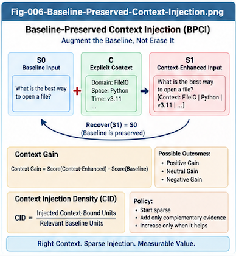

# MDT-UTN-CBT-005 — Baseline-Preserved Context Injection

## Context-Augmented Inference with a Recoverable Control Group

**Repository:** Metric-Differential-Tree UTN and Context-Bound Token Intelligence (MDT-UTN-CBT)  
**Document:** MDT-UTN-CBT-005  
**Status:** Algorithmic Foundation  
**Version:** v1.0.0

---

## Abstract

Context-Bound Tokens (CBTs) introduce explicit structural context into token-based intelligence systems through representations such as:

```text
token@context
````

However, adding explicit context raises an immediate methodological question:

> How can we determine whether the injected context actually improves inference rather than merely changing it?

This document introduces **Baseline-Preserved Context Injection (BPCI)**.

The key requirement is simple:

> **Every context-enhanced input should preserve a mechanically recoverable context-free baseline.**

For example:

```text
Enhanced Input:
rollback rollback@DatabaseTransaction transaction
```

can be reduced to:

```text
Baseline Input:
rollback transaction
```

by removing the context-bound augmentation.

This creates a paired inference design:

```text
Baseline Input  → Baseline Result
Enhanced Input  → Enhanced Result
```

and therefore a measurable structural delta:

```text
Context Gain
=
Score(Enhanced Input)
-
Score(Baseline Input)
```

The resulting comparison is not merely an evaluation technique.

It becomes a runtime control mechanism.

A policy can:

* accept beneficial context gain;
* suppress unstable context influence;
* reduce excessive context density;
* back off toward baseline when counter-evidence appears;
* preserve ambiguous contexts;
* archive successful context injections;
* archive harmful context injections as Negative Delta Intelligence.

This produces a reversible and experimentally controlled form of structural evidence injection.

The central thesis is:

> **Context should augment inference without erasing the baseline from which its contribution can be measured.**

---

# 1. The Problem with Uncontrolled Context Injection

Explicit context can improve inference.

But it can also distort it.

Suppose a model receives:

```text
rollback@DatabaseTransaction
```

when the real context is:

```text
rollback@Deployment
```

The explicit structural cue may anchor the model toward the wrong interpretation.

Therefore the important question is not merely:

> Does context change the answer?

The stronger question is:

> **Does context produce a validated improvement relative to the same input without that context?**

Without a baseline, this distinction is difficult to measure.

---

# 2. Context Injection Should Have Its Own Control Group

Conventional experiments often require separately constructed control inputs.

CBT provides a useful property:

```text
token
+
token@context
```

can preserve the original token sequence.

Therefore the baseline is already embedded in the enhanced representation.

Conceptually:

```text
Enhanced Input
      │
      ├── Raw Baseline Content
      │
      └── Context Augmentation
```

Removing the augmentation gives the original baseline.

This leads to the principle:

> **Every context-enhanced input should have a recoverable context-free baseline.**

---

# 3. Definition of Baseline-Preserved Context Injection

**Baseline-Preserved Context Injection (BPCI)** is defined here as:

> **A structural context augmentation method in which the enhanced input preserves a deterministic path back to the original context-free input.**

Canonical form:

```text
S1
=
S0
+
C
```

where:

```text
S0 = Baseline Input
S1 = Context-Enhanced Input
C  = Context-Bound Structural Evidence
```

and:

```text
Remove(C, S1)
=
S0
```

The reversibility requirement is fundamental.

---

# 4. A Minimal Example

Baseline:

```text
rollback transaction safely
```

Enhanced:

```text
rollback rollback@DatabaseTransaction transaction safely
```

Recover:

```text
remove rollback@DatabaseTransaction
```

Result:

```text
rollback transaction safely
```

Thus:

```text
Enhanced Input
       ↓
Remove CBT
       ↓
Baseline Input
```

The enhanced form contains its own control condition.

---

# 5. Baseline Preservation Is More Than Convenience

This property provides several important benefits:

```text
Explainability
Reversibility
A/B comparison
Counterfactual testing
Policy control
Failure diagnosis
Negative-delta learning
```

If an enhanced inference behaves unexpectedly, the system can compare it directly with the baseline.

This makes context influence observable.

---

# 6. The Paired-Inference Model

Let:

```text
S0 = baseline sequence
S1 = context-enhanced sequence
```

Then run:

```text
R0 = Model(S0)
R1 = Model(S1)
```

where `Model` may be:

```text
LLM
Search Engine
Ranker
Query Router
Cache Selector
Agent
Brain Unit
```

The comparison is:

```text
Delta
=
Evaluate(R1)
-
Evaluate(R0)
```

This delta measures the effect of explicit context under the selected evaluation policy.

---

# 7. Context Gain

Define:

```text
Context Gain
=
Performance(S1)
-
Performance(S0)
```

The exact performance function depends on the task.

For an LLM:

```text
accuracy
verifier score
reasoning consistency
structural localization
tool-selection quality
```

For search:

```text
precision
recall
ranking quality
false-positive reduction
```

For query routing:

```text
fan-out reduction
routing accuracy
latency
server load
```

For cache:

```text
cache hit quality
collision reduction
reuse rate
```

Therefore Context Gain is a general evaluation concept, not an LLM-specific metric.

---

# 8. Positive, Neutral, and Negative Context Gain

A context injection may produce:

```text
Positive Gain
Neutral Gain
Negative Gain
```

Conceptually:

```text
Context Gain > 0
    useful context

Context Gain ≈ 0
    unnecessary context

Context Gain < 0
    harmful context
```

This distinction is important.

A mature structural intelligence system should learn not only which contexts help, but also which contexts should not be injected.

---

# 9. Negative Delta Intelligence

A harmful context injection should not simply be discarded.

It is valuable evidence.

For example:

```text
Baseline:
correct result

Enhanced:
incorrect result

Injected Context:
DatabaseTransaction

Actual Context:
Deployment
```

This produces a negative structural case:

```text
Context Injection
      ↓
Inference Degradation
      ↓
Validation Failure
      ↓
Negative Delta Intelligence
```

Future policy can use this case to avoid similar errors.

---

# 10. Successful Context Injection as Positive Delta Intelligence

The opposite case is equally useful.

```text
Baseline:
ambiguous / low-quality result

Enhanced:
correct localized result

Injected Context:
DatabaseTransaction

Validation:
passed
```

This becomes:

```text
Positive Context Injection Case
```

The system may archive:

```text
task
token
context
baseline result
enhanced result
context gain
validation
policy
```

for future reuse.

---

# 11. Context Injection Case Record

A conceptual record may be:

```text
ContextInjectionCase
{
    inputId

    baselineInput
    enhancedInput

    rawToken
    contextBoundTokens

    contextSource
    contextType
    contextConfidence

    baselineResult
    enhancedResult

    baselineScore
    enhancedScore
    contextGain

    validationResult
    counterEvidence

    injectionPolicy
    density

    taskType
    timestamp
    version
}
```

This turns every validated context experiment into reusable structural experience.

---

# 12. Baseline Score

The baseline score establishes what the existing system can already achieve.

Conceptually:

```text
Baseline Score
=
Score(Model(S0))
```

This matters because some inputs already contain enough implicit context.

In such cases:

```text
S0
```

may already perform well.

Adding CBTs may produce little or no gain.

Therefore CBT should not be evaluated against zero intelligence.

It should be evaluated against the actual baseline system.

---

# 13. Enhanced Score

The enhanced score measures the system under explicit context augmentation:

```text
Enhanced Score
=
Score(Model(S1))
```

The most useful quantity is then not the absolute Enhanced Score alone.

It is:

```text
Enhanced Score
-
Baseline Score
```

This isolates the incremental value of context.

---

# 14. Score Does Not Require Hidden Model Internals

A practical BPCI system should not assume access to hidden model attention weights or internal logits.

The evaluation score may come from external measures.

Examples include:

```text
task success
unit-test pass rate
verifier score
ranking score
retrieval quality
tool execution result
human validation
structural consistency
```

If model log probabilities are available, they may be used.

But they are not required.

Thus BPCI is compatible with closed and open systems.

---

# 15. Baseline Preservation Creates a Natural Counterfactual

Because:

```text
S1
```

can be reduced to:

```text
S0
```

the system can ask:

> What would this inference have done without explicit context?

This is a natural counterfactual.

Conceptually:

```text
Observed:
Model(S1)

Counterfactual:
Model(S0)
```

The difference reveals the effect of the structural augmentation.

---

# 16. Context Injection as Structural Evidence

CBT should be viewed as evidence, not command.

A useful conceptual model is:

```text
Base Evidence
+
Structural Context Evidence
```

The context should shift the inference landscape.

It should not automatically dictate the result.

Therefore:

> **Context injection is evidence augmentation, not answer replacement.**

---

# 17. Policy-Controlled Context Influence

The effect of context should be governed by policy.

Conceptually:

```text
Final Decision
=
Baseline Evidence
+
PolicyControlled(Context Evidence)
```

A simplified symbolic form is:

```text
Final Score
=
Baseline Score
+
λ × Context Delta
```

where:

```text
λ = Context Influence Policy
```

This is a conceptual control model.

It does not require literal direct manipulation of internal model logits.

---

# 18. Context Influence Can Vary

A high-confidence context may receive stronger influence:

```text
Context Confidence = High
→ Higher Allowed Influence
```

A weak or inferred context may receive lower influence:

```text
Context Confidence = Low
→ Lower Allowed Influence
```

A conflicting context may trigger:

```text
Counter-Evidence Search
Backoff
Multi-Context Evaluation
Human / LLM Review
```

Thus context influence becomes dynamic.

---

# 19. Context Confidence Sources

Confidence may depend on context source.

Possible sources include:

```text
Explicit user declaration
Upper-layer API
MDT localization
Validated UTN type
CCC identity
Historical successful case
LLM Top-K estimate
```

A policy may assign different trust levels.

For example:

```text
Validated UTN Type
    >
LLM Guess
```

in many situations.

But even validated context may become outdated under version change.

Therefore confidence should remain contextual and version-aware.

---

# 20. User-Provided Context and Baseline

Suppose the user explicitly writes:

```text
rollback@DatabaseTransaction
```

A system may still preserve:

```text
rollback
```

as the baseline lexical form.

Thus even user-provided explicit context can participate in BPCI.

The enhanced input may be:

```text
rollback rollback@DatabaseTransaction
```

while the baseline remains:

```text
rollback
```

This keeps the context contribution measurable.

---

# 21. Upper-Layer Context and Baseline

An application may know:

```text
Domain = Database
Space = TransactionManager
```

It can produce:

```text
rollback@DatabaseTransaction
```

without rewriting the original request.

Therefore:

```text
Original User Input
+
Upper-Layer CBTs
```

preserves the original user input as baseline.

This is particularly useful for API-driven systems.

---

# 22. LLM-Inferred Context and Baseline

If an LLM estimates context, the same rule applies.

Raw:

```text
rollback
```

Estimated:

```text
rollback@DatabaseTransaction
```

The system can compare:

```text
Model(rollback)
```

against:

```text
Model(rollback + rollback@DatabaseTransaction)
```

This helps evaluate whether the inferred context was actually useful.

---

# 23. Top-K Context Evaluation

When context is ambiguous, multiple enhanced inputs can be generated.

For example:

```text
S0:
rollback
```

Candidates:

```text
S1:
rollback rollback@DatabaseTransaction

S2:
rollback rollback@Deployment

S3:
rollback rollback@GitRepository
```

Then:

```text
Score(S0)
Score(S1)
Score(S2)
Score(S3)
```

can be compared.

This provides an explicit context search process.

---

# 24. Context Search as Controlled Branching

Instead of blind semantic enumeration inside the model, the system can make context alternatives explicit.

Conceptually:

```text
Baseline
   │
   ├── Context A
   ├── Context B
   └── Context C
```

Each context creates a controlled branch.

MDT-UTN can help generate and rank these branches.

This turns some implicit inference into explicit structural search.

---

# 25. Domain, Space, and Time Baselines

BPCI naturally supports dimensional testing.

Starting from:

```text
S0 = token only
```

generate:

```text
S1 = token@Domain
S2 = token@Space
S3 = token@Time
S4 = token@Domain@Space
S5 = token@Domain@Space@Time
```

Then compare each against the same baseline.

This reveals marginal context value.

---

# 26. Marginal Context Gain

For example:

```text
Gain(Domain)
=
Score(token@Domain)
-
Score(token)
```

Similarly:

```text
Gain(Space)
Gain(Time)
Gain(Domain + Space)
Gain(Domain + Space + Time)
```

This makes context selection empirical.

The system can discover which dimensions matter for which tasks.

---

# 27. Context Gain Curve

More context may initially improve performance.

Then the gain may flatten.

Eventually additional context may become harmful.

Conceptually:

```text
Performance
   ^
   |          /\
   |         /  \
   |        /    \
   |_______/______\____> Context Amount
```

Possible causes of degradation include:

```text
feature dilution
noise
wrong binding
over-specialization
repetition artifacts
token cost
anchoring
```

Therefore the goal is not maximum context volume.

It is optimal context contribution.

---

# 28. Minimum Context Increment for Maximum Gain

A practical optimization objective is:

> **Find the minimum context increment that produces the maximum useful decision gain.**

This balances:

```text
Accuracy
Precision
Cost
Latency
Robustness
Reuse
```

The best CBT policy may therefore be sparse.

---

# 29. Context Injection Density

Define a conceptual:

> **Context Injection Density (CID)**

as:

```text
CID
=
Number of injected context-bound units
/
Number of relevant raw units
```

Possible operating regions:

```text
CID = 0
Baseline

CID = Low
Sparse structural anchors

CID = Medium
Selective reinforcement

CID = High
Dense structural encoding
```

Each task may have a different optimal CID.

---

# 30. Repetition as a Weak Control Mechanism

Repeated context-bound tokens can increase structural evidence density.

For example:

```text
rollback
rollback@DatabaseTransaction
transaction
```

contains one context reinforcement.

A denser version might include several structurally related CBTs.

However, blindly repeating identical strings is risky.

A better approach is to inject complementary evidence.

For example:

```text
rollback@DatabaseTransaction
transaction@Database
manager@TransactionLayer
```

This raises context density without simple lexical duplication.

---

# 31. Global Context vs Local Context

BPCI can compare different encoding strategies.

## Global Context

```text
Context: DatabaseTransaction

rollback the operation
```

## Local CBT

```text
rollback@DatabaseTransaction the operation
```

## Hybrid

```text
Context: DatabaseTransaction

rollback rollback@DatabaseTransaction the operation
```

Each can be compared against the same baseline.

---

# 32. Why Local Binding Matters

Global context says:

> This entire input belongs to a domain.

Local CBT says:

> This specific symbol is bound to this specific structural identity.

For complex inputs, local binding can matter.

Example:

```text
graph@CallingGraph
node@Function
edge@CallRelation
delta@StructuralChange
```

Different tokens carry different structural roles within the same sentence.

This is difficult to represent with one global header alone.

---

# 33. Baseline-Preserved Prompt Engineering

Traditional prompt engineering often expands the prompt.

For example:

```text
You are working in the context of database transactions.
Interpret rollback specifically as transaction rollback.
```

BPCI provides another approach:

```text
rollback@DatabaseTransaction
```

while preserving the original natural-language request.

The prompt becomes:

```text
Original Prompt
+
Structural Augmentation
```

not:

```text
Rewritten Prompt Replacing Original Prompt
```

This is important for controlled comparison.

---

# 34. Structured Prompt Increment

A general prompt structure may be:

```text
[BASELINE]
Fix the rollback logic.

[STRUCTURAL CONTEXT]
rollback@DatabaseTransaction
function@TransactionManager
task@CodeRepair
```

The baseline section is unchanged.

The structural section is removable.

Therefore the experiment remains clean.

---

# 35. BPCI and Search

The same paired-control method applies to search.

Baseline query:

```text
rollback
```

Enhanced query:

```text
rollback@DatabaseTransaction
```

Compare:

```text
SearchPrecisionBaseline
SearchPrecisionEnhanced
```

Then:

```text
Context Search Gain
=
Enhanced
-
Baseline
```

This reveals whether explicit context improved retrieval.

---

# 36. BPCI and Query Routing

Baseline:

```text
status
```

may fan out to many services.

Enhanced:

```text
status@Deployment
```

may narrow routing.

Compare:

```text
fan-out
latency
routing accuracy
```

The context delta may therefore be operational rather than semantic.

---

# 37. BPCI and Cache

Baseline cache key:

```text
status
```

Enhanced cache key:

```text
status@Deployment
```

A context-aware cache may reduce collisions.

But too-specific context may lower hit rate.

Therefore BPCI provides the right comparison:

```text
cache precision
vs
cache reuse
```

The optimal context granularity can be selected empirically.

---

# 38. BPCI and Brain-Unit Dispatch

Baseline:

```text
retry
```

may have uncertain dispatch.

Enhanced:

```text
retry@DatabaseTransaction
```

may route directly to a transaction-recovery Brain Unit.

Compare:

```text
dispatch accuracy
fallback rate
latency
task success
```

This creates measurable Context Gain for dispatch.

---

# 39. BPCI and RAG

A RAG system can compare:

```text
Query
```

against:

```text
Query + CBT
```

Possible measurements:

```text
retrieval relevance
context quality
answer accuracy
document count
retrieval cost
```

This allows structural context encoding to be evaluated independently from model architecture changes.

---

# 40. BPCI and Agents

An agent receiving:

```text
deploy
```

may need to infer many possible operational contexts.

With:

```text
deploy@ProductionService
```

the action space may narrow.

The baseline comparison can measure:

```text
planning steps
tool calls
incorrect branches
task completion
```

Thus BPCI applies to decision systems, not only text generation.

---

# 41. Context Gain Is Task-Specific

A CBT that helps one task may not help another.

For example:

```text
version@Time
```

may be critical for:

```text
cache invalidation
```

but irrelevant for:

```text
simple lexical lookup
```

Therefore Context Gain should be indexed by:

```text
Context
Task
Policy
System
Version
```

not treated as a universal constant.

---

# 42. Policy-Controlled Acceptance

A runtime may define:

```text
if ContextGain is strongly positive
    accept enhanced result

if ContextGain is neutral
    prefer cheaper baseline

if ContextGain is negative
    reject or downweight context

if ContextGain is unstable
    trigger additional validation
```

This turns BPCI into a decision-control framework.

---

# 43. Baseline Backoff

When context is uncertain or harmful, the system can back off.

Conceptually:

```text
Enhanced
   ↓
Conflict / Negative Gain
   ↓
Remove Context
   ↓
Baseline
```

This is one of the major safety properties of reversible augmentation.

The system does not need to commit to the enhanced representation permanently.

---

# 44. Hierarchical Backoff

Because contexts may have MDT hierarchy, backoff can occur gradually.

For example:

```text
rollback@DatabaseTransaction
        ↓
rollback@Transaction
        ↓
rollback@Database
        ↓
rollback
```

If the deepest context performs poorly, a parent context may work better.

Thus BPCI can use structural backoff rather than binary context/no-context switching.

---

# 45. Context Depth Search

A runtime may evaluate:

```text
S0 = rollback

S1 = rollback@Database

S2 = rollback@Transaction

S3 = rollback@DatabaseTransaction
```

and select the best validated level.

This creates a:

> **Context Depth Search**

The MDT provides the hierarchy.

BPCI provides the measurement.

---

# 46. Counter-Evidence Search

A context that improves one score may still conflict with important evidence.

For example:

```text
Enhanced score rises
```

but:

```text
unit tests fail
```

Therefore Context Gain should not override validation.

The runtime should ask:

```text
What evidence contradicts this context-enhanced result?
```

This preserves the Two-Way search principle of MDT-UTN.

---

# 47. Context Gain and Validation Are Different

A useful distinction is:

```text
Context Gain
=
Did the context improve the selected score?

Validation
=
Is the resulting output actually acceptable?
```

Both matter.

A high-scoring but invalid result should not be accepted.

Therefore:

```text
Context Gain
+
Validation
→
Context Decision
```

---

# 48. Unit-Test Validation for AI Coding

In coding tasks, BPCI has a particularly strong external validator:

```text
Unit Tests
```

For example:

```text
Baseline code generation
→ 7/10 tests pass

CBT-enhanced generation
→ 10/10 tests pass
```

This produces clear positive gain.

The reverse case becomes Negative Delta Intelligence.

---

# 49. Structural Consistency Validation

Not every task has executable unit tests.

Other validation can include:

```text
CallingGraph consistency
type consistency
policy consistency
schema consistency
retrieval consistency
human review
cross-model verification
```

The BPCI framework does not depend on one validator.

---

# 50. A/B Experimental Ladder

A canonical validation ladder is:

```text
L0
Raw baseline

L1
Ordinary natural-language context

L2
Token + CBT dual-track

L3
Policy-controlled CBT density

L4
MDT-UTN-generated context

L5
MDT-UTN + CCC context

L6
MDT-UTN + CCC + Brain-Unit dispatch
```

This allows increasingly structural interventions to be compared.

---

# 51. Why Ordinary Natural-Language Context Must Be a Baseline

A strong experiment should not compare only:

```text
No Context
vs
CBT
```

because ordinary prompt context may already solve the problem.

A more rigorous comparison is:

```text
Baseline A
Raw input

Baseline B
Raw input + ordinary natural-language context

Structural Condition
Raw input + explicit CBT
```

This asks the stronger question:

> **Does explicit structural encoding add value beyond ordinary natural-language context?**

---

# 52. Three Important Baselines

For many LLM experiments, use:

```text
B0
Raw Input

B1
Raw Input + Natural-Language Context

B2
Raw Input + Context-Bound Tokens
```

Optionally:

```text
B3
Raw Input + Natural-Language Context + CBT
```

This avoids overstating CBT benefit.

---

# 53. Baseline Preservation and Reproducibility

Because the baseline is mechanically recoverable, experiments become easier to reproduce.

A repository can publish:

```text
Enhanced Input
Context Removal Rule
Scoring Function
Validation Rule
```

Then any evaluator can reconstruct:

```text
Baseline Input
```

This strengthens methodological clarity.

---

# 54. Context Removal Rule

The removal rule should itself be explicit.

For example:

```text
Remove all injected CBT entries
that were marked as structural augmentation.
```

It should not rely on guessing which terms were original.

Therefore a practical implementation should retain provenance:

```text
original token
injected token
source
position
context ID
```

---

# 55. Baseline Fidelity

A valid BPCI transformation should satisfy:

```text
Recover(S1)
=
S0
```

with minimal or zero semantic alteration.

If removal changes punctuation, order, grammar, or original content substantially, the baseline comparison becomes weaker.

Therefore:

> **Baseline fidelity is an algorithmic invariant.**

---



---

# 56. Context-Bound Tokens Should Be Marked as Augmentation

A system should know which units were added.

For example:

```text
Raw:
rollback

Injected:
rollback@DatabaseTransaction
```

This distinction enables:

```text
removal
attribution
gain calculation
provenance
```

Without it, BPCI becomes ambiguous.

---

# 57. Context Contribution Attribution

When multiple CBTs are injected, the system may ask:

```text
Which CBT produced the gain?
```

This can be studied by ablation.

For example:

```text
S0
baseline

S1
+ token@Domain

S2
+ token@Space

S3
+ token@Time

S4
+ all three
```

Comparing these conditions estimates contribution by dimension.

---

# 58. Context Ablation

A larger enhanced input may contain:

```text
task@CodeRepair
rollback@DatabaseTransaction
function@TransactionManager
version@CurrentRelease
```

Ablation removes one context at a time.

This can reveal:

```text
critical context
redundant context
harmful context
```

Thus CBT can support systematic structural attribution.

---

# 59. Policy Learning from Context Gain

Over time, the system may learn:

```text
For Task Type A:
Domain context is highly useful

For Task Type B:
Time context is critical

For Task Type C:
Space context adds little

For Task Type D:
Dense CBT injection is harmful
```

This knowledge can become policy.

Thus:

```text
Repeated BPCI Cases
      ↓
Context Policy Learning
```

becomes possible.

---

# 60. Context Policy as Folded Experience

A mature policy need not rediscover optimal context every time.

Successful historical cases can be folded.

For example:

```text
Task:
Database transaction repair

Best Context:
Domain + Space

Preferred CID:
Low

Observed Gain:
High
```

This can be reused for similar future tasks.

The policy itself becomes structural memory.

---

# 61. BPCI and TACG-SDIG

A BPCI case naturally forms:

```text
Task
  ↓
Context Injection Action
  ↓
Inference Delta
  ↓
Validation
  ↓
Structural Delta Intelligence
```

Therefore:

```text
Context Injection
```

can be treated as an action whose effect is measured.

Successful and failed injections both become future decision evidence.

---

# 62. The Structural Delta Loop

Canonical loop:

```text
Input
  ↓
Baseline Inference
  ↓
Context Injection
  ↓
Enhanced Inference
  ↓
Delta Measurement
  ↓
Validation
  ↓
Positive / Negative Case
  ↓
Policy Update
```

This makes context encoding evolutionary.

---

# 63. From Static Prompting to Context Policy

Traditional prompting often relies on manually crafted instructions.

BPCI suggests a more systematic progression:

```text
Manual Prompt Context
       ↓
Explicit CBT
       ↓
Measured Context Gain
       ↓
Context Policy
       ↓
Reusable Structural Injection
```

Prompt engineering becomes partially structural and measurable.

---

# 64. Baseline-Preserved Structural Prompting

A useful principle is:

> **Never sacrifice the original prompt merely to add structural context.**

Instead:

```text
Original Prompt
+
Removable Structural Layer
```

This allows:

```text
comparison
rollback
debugging
validation
```

and preserves user intent.

---

# 65. Inference-Time Context Governance

Context policy can operate at inference time.

Possible decisions:

```text
Inject
Do Not Inject
Inject Sparse Context
Inject Parent Context
Inject Top-K Contexts
Back Off
Escalate
```

Thus context encoding becomes an active runtime decision rather than a static preprocessing rule.

---

# 66. Context Conflict Handling

Suppose:

```text
User Context:
DatabaseTransaction
```

while MDT localization suggests:

```text
Deployment
```

The system should not silently choose one.

Possible actions:

```text
Preserve both
Compare both against baseline
Search counter-evidence
Ask for clarification when necessary
Keep unresolved state
```

BPCI gives a natural way to compare competing contexts.

---

# 67. Competing Context Evaluation

For example:

```text
S0
baseline

S1
+ DatabaseTransaction

S2
+ Deployment
```

Then evaluate:

```text
Score(S0)
Score(S1)
Score(S2)
```

plus validation.

This turns ambiguity into explicit structural experimentation.

---

# 68. Context as a Controlled Inference Variable

BPCI treats context as an independent variable.

Conceptually:

```text
Input Content = fixed
Context        = varied
Output         = measured
```

This is a powerful methodological property.

It separates:

```text
what was asked
```

from:

```text
which structural context was injected
```

---

# 69. Baseline-Preserved Context Differential Test

A canonical Context Differential Test can be:

```text
Baseline:
commit

Condition A:
commit@GitRepository

Condition B:
commit@DatabaseTransaction
```

Expected result:

```text
same lexical token
+
different structural context
→
meaningful downstream behavioral delta
```

If behavior does not change when it should, the context encoding may be ineffective.

If behavior changes too strongly, it may be over-anchored.

---

# 70. Stability Testing

The same BPCI experiment should be repeated across:

```text
multiple runs
multiple prompts
multiple examples
multiple models
multiple task variants
```

A context gain that appears only once may not be reliable.

Therefore useful context should ideally show:

```text
positive gain
+
stability
+
validation
```

---

# 71. Context Gain Is Not Enough

A strong result should consider:

```text
Gain
Stability
Cost
Latency
Validation
Robustness
```

For example:

```text
+2% accuracy
+80% token cost
```

may not be useful.

Likewise:

```text
+10% accuracy
but severe wrong-context failure
```

may require stronger governance.

---

# 72. A Multi-Objective Context Policy

Conceptually:

```text
Context Utility
=
f(
    gain,
    cost,
    latency,
    stability,
    confidence,
    validation,
    risk
)
```

This is more useful than maximizing one score.

Different systems can define different policy functions.

---

# 73. Search Entropy Reduction

One potential benefit of explicit context is reducing the number of plausible interpretations.

Conceptually:

```text
Before Context:
many candidate meanings

After Context:
smaller candidate set
```

This can be treated as:

> **Context Search Reduction**

A conceptual measure is:

```text
Context Search Reduction Ratio
=
Candidate Contexts Before
/
Candidate Contexts After
```

This is particularly relevant to query servers, routing, and reasoning systems.

---

# 74. Reduced Blind Enumeration

Without explicit context, a reasoning system may consider:

```text
Maybe A
Maybe B
Maybe C
Maybe D
```

With a high-confidence CBT:

```text
token@A
```

many branches become unnecessary.

This may reduce:

```text
reasoning steps
token usage
tool calls
search fan-out
```

BPCI provides the baseline necessary to measure that reduction.

---

# 75. Context Should Reduce Unnecessary Work, Not Necessary Doubt

A context system should eliminate irrelevant ambiguity.

It should not eliminate justified uncertainty.

Therefore:

```text
High-confidence context
→ narrow search

Low-confidence context
→ preserve alternatives
```

This is why confidence, counter-evidence, and leftover states remain important.

---

# 76. BPCI and Explicit Unknown

Sometimes the correct context is:

```text
UNKNOWN
```

or:

```text
LEFTOVER
```

In such cases, the system should preserve the baseline rather than manufacture certainty.

Conceptually:

```text
No Valid Context
      ↓
Use Baseline
      ↓
Search / Learn Later
```

This is preferable to harmful forced injection.

---

# 77. Baseline as a Safe Fallback

Because the baseline is always recoverable, the system retains a stable fallback path.

This is important for incremental adoption.

A CBT layer can be added externally while preserving:

```text
existing system behavior
```

when context confidence is low or policy disables augmentation.

Thus BPCI supports graceful deployment.

---

# 78. Baseline-Preserved Adoption Strategy

A practical rollout path is:

```text
Phase 0
Baseline system only

Phase 1
CBT shadow evaluation

Phase 2
CBT advisory mode

Phase 3
Policy-controlled CBT use

Phase 4
Structural context learning

Phase 5
Integrated MDT-UTN context runtime
```

At every stage, the baseline remains available.

---

# 79. Shadow Evaluation

In shadow mode:

```text
Baseline result
```

is used operationally.

Meanwhile:

```text
Enhanced CBT result
```

is computed only for comparison.

This allows Context Gain and failure modes to be studied without changing production behavior.

This is a natural future validation strategy.

---

# 80. BPCI Is Compatible with v1.0.0 Algorithm-First Design

The framework defined here does not require:

```text
tokenizer modification
model retraining
new LLM architecture
Java runtime implementation
```

The v1.0.0 goal is to define:

```text
logic
invariants
comparisons
validation method
policy boundaries
```

Executable implementation can follow in later versions.

---

# 81. Algorithmic Invariants

The following invariants define BPCI.

## Invariant 1 — Recoverable Baseline

> The original context-free input must remain mechanically recoverable.

## Invariant 2 — Context Is Additive

> Structural context augments rather than silently replaces baseline content.

## Invariant 3 — Context Provenance

> Injected context should be distinguishable from original input.

## Invariant 4 — Paired Evaluation

> Baseline and enhanced inference should be comparable under the same task definition.

## Invariant 5 — Measurable Delta

> Context contribution should be evaluated through explicit outcome differences.

## Invariant 6 — Negative Gain Is Preserved

> Harmful context injections are learning evidence, not disposable noise.

## Invariant 7 — Policy Controls Influence

> Context strength, depth, and density should remain governable.

## Invariant 8 — Counter-Evidence Remains Active

> Context gain does not eliminate the need for contradiction search.

## Invariant 9 — Validation Dominates Apparent Gain

> A high score does not justify an invalid result.

## Invariant 10 — Baseline Remains a Fallback

> Context augmentation must not make the original inference path inaccessible.

---

# 82. Failure Modes

## Failure Mode A — Baseline Destruction

The enhanced prompt rewrites the original so heavily that no faithful baseline remains.

## Failure Mode B — Context as Authority

Injected context is treated as unquestionable truth.

## Failure Mode C — Score Without Validation

The system accepts a higher score despite external failure.

## Failure Mode D — Hidden Context Injection

The system cannot distinguish original tokens from added CBTs.

## Failure Mode E — No Negative Case Memory

Harmful context injections are forgotten.

## Failure Mode F — Context Explosion

Too many CBTs increase cost and reduce clarity.

## Failure Mode G — Blind Repetition

Identical context tokens are repeated without evidence of benefit.

## Failure Mode H — Single Baseline Only

CBT is compared only with no-context input rather than also with ordinary natural-language context.

## Failure Mode I — Forced Context

Unknown or ambiguous cases are assigned a context anyway.

## Failure Mode J — Static Policy

Context density and influence never adapt to task or history.

---

# 83. Canonical Validation Matrix

A minimal evaluation matrix is:

| Condition | Raw Input | Natural-Language Context | CBT | MDT-UTN Context | Purpose                   |
| --------- | --------: | -----------------------: | --: | --------------: | ------------------------- |
| B0        |       Yes |                       No |  No |              No | Raw baseline              |
| B1        |       Yes |                      Yes |  No |              No | Prompt-context baseline   |
| C1        |       Yes |                       No | Yes |              No | Explicit CBT              |
| C2        |       Yes |                       No | Yes |             Yes | MDT-UTN CBT               |
| C3        |       Yes |                      Yes | Yes |             Yes | Hybrid structural context |

Useful measurements include:

```text
Task Accuracy
Structural Localization
Validation Success
Search Precision
Reasoning Cost
Latency
Token Cost
Output Stability
Counter-Evidence Recovery
```

---

# 84. Canonical BPCI Algorithm

```text
INPUT:
    Baseline input S0
    Candidate contexts C
    Context policy P
    Evaluation function E
    Validation function V

STEP 1 — Preserve Baseline
    Store S0 unchanged

STEP 2 — Generate Context Candidates
    From user
    From API
    From MDT-UTN
    From CCC
    From LLM Top-K
    From historical cases

STEP 3 — Select Context
    Apply confidence
    Apply Domain / Space / Time policy
    Apply granularity policy

STEP 4 — Construct Enhanced Input
    S1 = S0 + Context-Bound Tokens

STEP 5 — Verify Recoverability
    Confirm Recover(S1) = S0

STEP 6 — Run Baseline Inference
    R0 = Model(S0)

STEP 7 — Run Enhanced Inference
    R1 = Model(S1)

STEP 8 — Evaluate
    Score0 = E(R0)
    Score1 = E(R1)

STEP 9 — Calculate Delta
    ContextGain = Score1 - Score0

STEP 10 — Validate
    V(R0)
    V(R1)

STEP 11 — Search Counter-Evidence
    Check context conflicts
    Check structural contradictions
    Check instability

STEP 12 — Policy Decision
    Accept enhanced result
    Prefer baseline
    Back off context depth
    Try alternative context
    Defer
    Escalate

STEP 13 — Archive Case
    Positive Delta Intelligence
    OR Negative Delta Intelligence

STEP 14 — Update Context Policy
    Reuse validated experience
```

---

# 85. Canonical Runtime Flow

```text
                       Baseline Input S0
                              │
                  ┌───────────┴───────────┐
                  │                       │
                  ▼                       ▼
            Baseline Inference      Context Encoder
                  │                       │
                  │                       ▼
                  │                token@context
                  │                       │
                  │                       ▼
                  │               Enhanced Input S1
                  │                       │
                  │                       ▼
                  │               Enhanced Inference
                  │                       │
                  ▼                       ▼
             Baseline Score         Enhanced Score
                  │                       │
                  └───────────┬───────────┘
                              ▼
                         Context Gain
                              │
                     ┌────────┼────────┐
                     ▼        ▼        ▼
                  Validate  Counter   Policy
                             Evidence
                     │        │        │
                     └────────┼────────┘
                              ▼
                     Accept / Backoff
                              │
                              ▼
                      Delta Intelligence
```

---

# 86. Relationship to MDT-UTN

MDT-UTN produces structured context identity:

```text
Context
  ↓
GenericContainerStarmap
  ↓
Metric-Differential Tree
  ↓
UTN Type
```

CBT exposes that identity:

```text
UTN Type
  ↓
token@context
```

BPCI then measures its value:

```text
token@context
  ↓
Enhanced Inference
  ↕
Baseline Inference
  ↓
Context Gain
```

Thus:

```text
MDT-UTN
produces context identity

CBT
encodes context identity

BPCI
measures and governs context influence
```

These are three distinct but complementary roles.

---

# 87. Relationship to the Next Document

This document establishes the controlled inference mechanism.

The next document expands context from:

```text
inference evidence
```

to:

```text
runtime address
```

for:

```text
Search
Cache
Delta Intelligence
Brain Units
```

The transition is:

```text
Context as Evidence
        ↓
Context as Address
```

That is the focus of:

```text
MDT-UTN-CBT-006
Context as an Address for Search, Cache,
Delta Intelligence, and Brain Units
```

---

# 88. Research Questions

### RQ-1

What is the best operational definition of Context Gain for different systems?

### RQ-2

How should Baseline Score and Enhanced Score be normalized across repeated trials?

### RQ-3

What Context Injection Density is optimal for different task classes?

### RQ-4

How much benefit does CBT provide beyond ordinary natural-language context?

### RQ-5

How should context confidence affect allowed influence?

### RQ-6

When should parent-context backoff outperform highly specific context?

### RQ-7

How should multiple competing contexts be compared efficiently?

### RQ-8

Can Negative Delta Intelligence predict future harmful context injections?

### RQ-9

How should historical Context Gain cases be folded into policy?

### RQ-10

Can BPCI reduce blind branch enumeration in LLM reasoning and agent planning?

### RQ-11

How stable are Context Gains across models, prompts, and task variants?

### RQ-12

Can the same BPCI framework govern Search, Cache, Routing, LLM, and Brain-Unit systems?

---

# 89. Conclusion

Context-Bound Tokens make structural context explicit.

But explicit context alone is not enough.

A reliable system must know whether that context actually helped.

Baseline-Preserved Context Injection provides the missing control mechanism.

The central structure is:

```text
Enhanced Input
=
Baseline Input
+
Context-Bound Tokens
```

with:

```text
Recover(Enhanced Input)
=
Baseline Input
```

This gives every enhanced inference a natural control group.

The system can therefore measure:

```text
Baseline Score
Enhanced Score
Context Gain
Validation Result
Counter-Evidence
```

and make a policy-governed decision.

Positive context deltas can become reusable intelligence.

Negative context deltas can become reusable warnings.

Context depth, density, source, confidence, and influence can all become policy variables.

The resulting framework is:

```text
reversible
measurable
auditable
counterfactual
policy-governed
incremental
```

The central principle is:

> **Context should augment the baseline, not erase it.**

The deeper methodological principle is:

> **Every structural-context inference should carry its own recoverable control group.**

And the evolutionary principle is:

> **Every validated context-induced inference delta can become future structural intelligence.**

---

## Canonical Summary

```text
Baseline Input
      │
      ├──────────────────────────────┐
      │                              │
      ▼                              ▼
Baseline Inference             Context Selection
      │                              │
      │                              ▼
      │                       token@context
      │                              │
      │                              ▼
      │                       Enhanced Input
      │                              │
      │                              ▼
      │                      Enhanced Inference
      │                              │
      ▼                              ▼
Baseline Score               Enhanced Score
      │                              │
      └──────────────┬───────────────┘
                     ▼
                Context Gain
                     │
          ┌──────────┼──────────┐
          ▼          ▼          ▼
       Validate   Counter-    Policy
                  Evidence
          │          │          │
          └──────────┼──────────┘
                     ▼
         Accept / Backoff / Retry
                     │
                     ▼
              Delta Intelligence
                     │
                     ▼
              Context Policy Growth
```

> **Preserve the baseline.
> Inject structural context.
> Measure the delta.
> Validate the result.
> Learn from both improvement and failure.**

